# python基础

​      **学习方法**

1. 每天知识点必须理解（定义、作用、适用性、语法）。

2. 每天练习必须会做（独立完成）。

3. 将理论、代码、图示形成笔记保留下来（合三为一）。

4. 课上注意听！课下抓紧练、不懂马上问（群讨论）。

## **Python 简介**

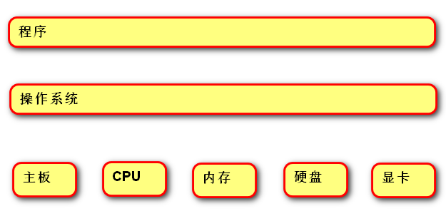 

程序员：

程序设计人员。

程序：

一组由计算机负责执行的指令，是实现某种需求的软件。 

操作系统：

管理和控制计算机硬件与软件资源的程序，隔离不同硬件的差异，使开发程序简单化。

例如，Windows，Linux，Unix。

硬件：

主板--计算机的主要电路系统。

CPU --主要负责执行程序指令，处理数据。

硬盘--持久化存储数据的记忆设备，容量大，速度慢。

内存--临时存储数据的记忆设备，容量小，速度快。

IO设备--键盘、鼠标、显示器。

## **Python 定义**

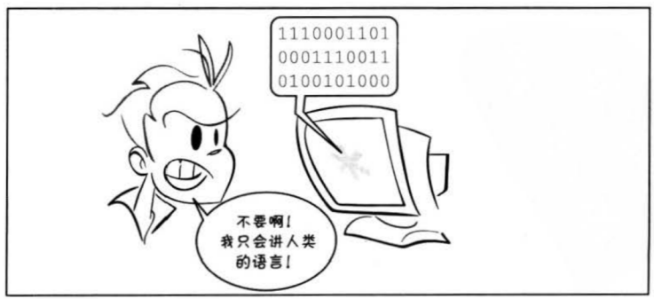 

是一个免费、开源、跨平台、动态、面向对象的编程语言。

## **Python程序的执行方式**

### **交互式**

在命令行输入指令，回车即可得到结果。

1. 打开终端

2. 进入：python3

3. python代码：print(“hello world”) 

4. 离开：exit()   quit()

### **文件式**

将指令编写到.py文件，可以重复运行程序。

1. 在指定目录中创建Python文件

目录：/home/tarena/month01/python_base/day01

文件名:hello.py

2. 在终端命令行输入如下命令: 

​    cd /home/tarena/month01/python_base/day01

python3 hello.py

## **Linux常用命令**

(1) pwd：查看当前工作目录的路径 

(2) ls：查看指定目录的内容或文件信息    

(3) cd命令:改变工作目录（进入到某个目录）       

(4) touch :创建文件    

  练习1：创建python程序，输出你好，世界！

   通过文件式执行。

## **执行过程**

 

计算机只能识别机器码(1010)，不能识别源代码(python)。

由源代码转变成机器码的过程分成两类：编译和解释。

编译：在程序执行之前，通过编译器将源代码变成机器码；

运行时，计算机就可以直接执行。例如：C语言。

优点是运行速度快；缺点是开发效率低，不能跨平台。

解释：运行时，通过解释器对程序逐行解释，然后运行。例如Javascript

​      优点是开发效率高，可以跨平台；缺点是运行速度低。

 

python是解释型语言，但出于效率的考虑，提供了一种编译的方法。编译之后就得到 pyc文件，存储了字节码（特定于Python的表现形式，不是机器码）。

 

​	python执行过程：

​	python 的运行后才进行编译

​	源代码 –编译--> 字节码(pyc文件)–解释--> 机器码

​	|————1次————|

## **Python 版本**

​	python 2.7（2020年结束维护）

python 3.5（教学版本）

python 3.8（最新）

## **解释器类型**

CPython（C语言开发)  主要用这个

Jython (java开发)

IronPython (.net开发)

# **数据基本运算**

## **pycharm常用快捷键**

移动到本行开头：home键

移动到本行末尾：end键盘

注释代码：ctrl + /

复制行：ctrl +d

选择列：鼠标左键 + alt

移动行：shift + ctrl + 上下箭头

智能提示：Ctrl + Space

ctrl+alt+l  规范空格

 

百度增加

## **注释**

给人看的，通常是对代码的描述信息。

1. 单行注释：以#号开头。

2. 多行注释：三引号开头，三引号结尾。   多用于最上面

3. 模块，类，的注释不可少，

## **函数**

表示一个功能，函数定义者是提供功能的人，函数调用者是使用功能的人。

例如：

print(数据) 作用：将括号中的内容显示在控制台中

变量 = input(“需要显示的内容”) 作用：将用户输入的内容赋值给变量

代码：day02/day01_exercise/exercise01.py

练习2：看看教程 [www.runoob.com](http://www.runoob.com/)

练习3：逛逛社区 [www.pythontab.com](http://www.pythontab.com/) 

 

## **变量**

代码：day01/code01

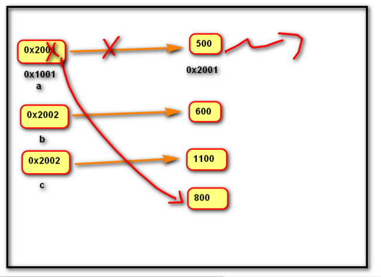 

定义：关联一个对象的标识符。     变量名=表达式

​    命名：必须是字母或下划线开头，后跟字母、数字、下划线。

​          不能使用python的关键字(蓝色)，否则发生语法错误：SyntaxError: invalid syntax。

建议命名：字母小写，多个单词以下划线隔开。

​          class_name

​          见名知意

赋值：创建一个变量或改变一个变量绑定的数据。

​    语法：变量名 = 数据

​          变量名1 = 变量名2 = 数据

​          变量名1, 变量名2, = 数据1, 数据2

​	变量就是存储对象地址的标识符

练习1:画出下列代码内存图

​	a =”我”

​	b = “爱”

 	a =”python”

​	d = a + b

练习2：在控制台中依次获取两个变量，然后交换变量，

输出结果。

​	例如：请输入第一个变量：100

请输入第二个变量：200

….

第一个变量是：200

第二个变量是：100

代码：day02/ exercise01

## **del 语句**

语法: del 变量名1, 变量名2

作用：用于删除变量,同时解除与对象的关联关系.如果可能则释放对象。

自动化内存管理的引用计数：每个对象记录被变量绑定(引用)的数量,当为0时被销毁。

## 核心数据类**型**

在python中变量没有类型，但关联的对象有类型。

通过type函数可查看。

### **空值对象** **None**

  	表示不存在的特殊对象

作用:

​    		用来占位

   		变量解除绑定

### 整形int

整数，包含正数、负数、0。

​     \- 如： -5, 100, 0

字面值：

-- 十进制：5 

-- 二进制：0b101

0   1   10   11  100    101    110   111    1000    逢2进1

-- 八进制方式表示(0o开头，后跟0~7)

 

-- 十六进制表示(0x开头后跟0~9,A~F,a~f)

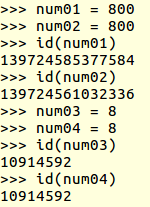 

小整数对象池：CPython 中整数 -5 至 256,永远存在小整数对象池中,不会被释放并可重复使用。（在交互式里，绝对正确。在文件式里可能范围不只这个大小，可能范围更大）

使用函数  id（）查询内存地址   

### 浮点型float

小数(包含正数、负数，0.0) 

字面值：

-- 小数：1.0   2.5

-- 科学计数法：e/E (正负号) 指数 

​       1.23e-2 (等同于0.0123)       e==>10**int    e-2==0.01

​       1.23456e5(等同于123456.0)      e5==100000

### 字符串str

​	是用来记录文本信息(文字信息)。

​	字面值：双引号

### 复数complex

由实部和虚部组成的数字。

虚部是必须以j或J结尾。

字面值： 1j     1+1j   1-1j 

### 布尔bool

用来表示真和假的类型

True 表示真(条件满足或成立)，本质是1    可以和数字类型做运算 3+True ==4

False 表示假(条件不满足或不成立)，本质是0

## **数据类型转换**

​	转换为整形: int(数据)

​	转换为浮点型:float(数据)

​	转换为字符串:str(数据)

​	转换为布尔:bool(数据)

​         -- 结果为False：bool(0)  bool(0.0)  bool(None)  

混合类型自动升级：

  1 + 2.14  返回的结果是 3.14

  1 + 3.0   返回结果是:  4.0

## **运算符**

### **算术运算符**

  代码：day02/code02

\+  加法

  \-  减法

  \*  乘法

  /  除法：结果为浮点数

  // 地板除：除的结果去掉小数部分

  %  求余

  ** 幂运算

优先级从高到低： 

​          **   幂运算

​                          \*  / % //

​                      \+  -

### **增强运算符**

  代码：day02/code02.py

   y += x      等同于 y = y + x

   y -= x      等同于 y = y - x

   y *= x      等同于 y = y * x

   y /= x      等同于 y = y / x

   y //= x     等同于 y = y // x

   y %= x      等同于 y = y % x

   y **= x     等同于 y = y ** x

### **比较运算符**

​    代码 day02/code02.py

​    <    小于

​    <=   小于等于

​    \>    大于

​    \>=   大于等于

​    ==   等于

​    !=   不等于

​    返回布尔类型的值

比较运算的数学表示方式:0 <= x <= 100

练习1：在控制台中依次获取小时，分钟，秒，

​		计算总秒数。

代码：day02/exercise02.py

 

练习2：在控制台中获取一个4位整数，

​		计算每位相加和。

​		例如：1234

​			  1 + 2+3+4

代码：day02/exercise03.py

### **逻辑运算符**

代码 day02/code02.py

#### **与and**

​    表示并且的关系，一假俱假。         

  示例:

​    True and True    # True

​    True and False   # False

​    False and True   # False

False and False  # False

#### **或or**

表示或者的关系，一真俱真     

  示例:

​    True or True     # True

​    True or False    # True

​    False or True    # True

​    False or False   # False 

#### **非 not** 

表示取反

例如：

not True   # 返回False

not False  # 返回True

not 100    # 返回False

 

#### **作用**

​	比较两个bool值关系。

​	例如：

​	限制飞机水平范围

​	如果 到了最左边 and 还想想左移动   or   到了最右边 and 还想向右移动

 			  停

练习：在控制台中输入一个年份

​	  判断是否为闰年

​		条件1：年份能被4整除，但是不能被100整除

​		条件2：年份能被400整除

代码：day02/exercise04.py

#### **短路运算**

 		and 语句出现第一个false 后面的语句就不执行了       因为结果已经确定为False了

​		or  出现第一个True 后面就是不执行后面的语句		同理已经知道是True了

​                    一但结果确定，后面的表达式将不再执行。

​		将比较消耗时间的语句放在后面去判断

### **身份运算符**

   代码：day02/code06.py

语法:

​    		x is y

​    		x is not y

作用：

is 用于判断两个对象是否是同一个对象（）时返回True,否则返回False。

   		is not 的作用与is相反

### **优先级**

​	高到低：

算数运算符    + - /  //

比较运算符     > <   

快捷运算符   +=  -=   

身份运算符    is   is not

逻辑运算符    and  or

 

## **调试步骤**

​	目的：

\1. 理解程序执行过程

\2. 排除逻辑错误(不是Error)

​	步骤：

\1. 加断点(程序运行到本行停止，没有执行本行)

\2. 开始调试shift+alt+f9

\3. 逐行执行 F7，F8

\4. 停止调试ctrl + f2

错误信息

  File "/home/tarena/1902/month01/day02/exercise03.py", line 10, in <module>

​    unit04 = number // 1000 + "a"

TypeError: unsupported operand type(s) for +: 'int' and 'str'

 

  File "文件路径", line 行号, in <module>

​    错误代码

XXXError: 错误描述

 

day02 作业：

\1. 使用二进制输出1  3   5

八进制  1  8  10

十六进制  1  13  20

代码：day03/day02_exercise/ exercise01

 

\2. 在控制台中获取圆形的半径，

输出面积(3.14 * r 的平方)与周长(2 * 3.14 * r)

代码：day03/day02_exercise/ exercise02

 

\3. 在控制台中输入总秒数，计算几小时零几分钟零几秒钟。

代码：day03/day02_exercise/ exercise03

 

\4. 读书：Python编程：从入门到实践 第二章

 

 

## **内置函数**

round(数据，精度)：四舍五入，精度如果省略，则默认为0.

## **del 语句**

\1. 作用：del 语句可以删除变量

\2. 语法：del 变量名1，变量名2

\3. 对象引用计数：当对象绑定给变量时，计数增加1，当变量解除绑定时，计数减少1.待计数为0时，对象自动释放。

\4. 实例：

​	a = 800

​	del a

​	此时变量a被删除，对象800被释放

​	a = 800

​	b = a

​	del a

​	此时变量a被删除, 对象800不会释放。

​	del b 

此时变量b被删除, 对象800被释放。

 

​	练习：画出下列代码内存图

​	num01 = 500

​	num02 = 500

​	num03 = num01

​	num01 = None

​	del num03

# **语句**

## **行**

1.物理行：程序员编写代码的行。

\# print(a)

\#print(b)   两个物理行

2.逻辑行：python解释器需要执行的指令。

3.示例：print(a);print(b)            输出是两行        物理一行 逻辑两行

 

建议一个逻辑行在一个物理行上。

如果一个物理行中使用多个逻辑行，需要使用分号；隔开。

如果逻辑行过长，可以使用隐式换行或显式换行。()

-- 隐式换行：所有括号的内容换行,称为隐式换行

   括号包括:  ()  []   {} 三种

-- 显式换行：通过折行符 \ (反斜杠)换行，必须放在一行的末尾，目的是告诉解释器,下一行也是本行的语句。 

\     用了是     物理两行    逻辑一行

## **pass 语句**

  	作用:通常用来填充语法空白。

if xxxx：

​		pass

​	else:

​		yyy

## **选择语句**

### **If elif else** **语句**

作用:

​    让程序根据条件选择性的执行语句。

  语法:

​    if 条件1:

​        语句块1    满足条件1

​    elif 条件2:

​        语句块2    不满足条件1且满足条件2

​    else:

​        语句块3   不满足条件1 且不满足条件2

  说明:

​    elif 子句可以有0个或多个。

​    else 子句可以有0个或1个,且只能放在if语句的最后。

练习1：在控制台中获取一个整数，

​		如果是整数则打印”正数”

​		如果是负数则打印”负数”

​	 	如果是零则打印”零”

代码：day03/exercise01.py

 

练习2：在控制台中获取一个月份，

​    　　打印春(１--3)　夏(4--6)　秋(7--9)　冬(10--12)

代码：day03/exercise02.py

 

练习3：输入月份，返回天数

2 月 28天　　　

1　３　５　７　８　１０　１２　月 ３１天

​    4  6  9  11 月　３０天

代码：day03/exercise03.py

### **if** **语句的真值表达式**

​    if 100:

​        print("真值")

​    等同于

​    if bool(100):

​        print("真值")

当判断是否可以整除的情况时，都可以直接用，判断结果有0

代码：day03/exercise04.py

练习2： 判断闰年，如果是闰年输出29天，

​		否则输出28天。

代码：day03/exercise05.py

### **条件表达式**

  代码：day03/exercise05.py

语法:

​    变量=结果1 if 条件 else 结果2

  作用:

根据条件(True/False) 来决定返回结果1还是结果2。

一个判断，2个结果，需要赋值就可以使用

 

3#调试：让程序在指定的行中断，然后逐语句执行，

1.在可能出错的行加入断点

2.开始调试（pycharm ,f7/F8是下一步）多多使用F8进入下一步，这样就不会进入内部函数库

 

## **循环语句**

### **while****语句 （万能循环语句）**

  作用: 可以让一段代码满足条件，重复执行。

  语法:

​    while 条件:

​        满足条件执行的语句

​    else:

​        不满足条件执行的语句          

 

当循环需要到达某项条件通过break来退出时，else执行条件正好是满足break条件的对立事件的执行语句，而因为不在循环里而避免被多次执行的尴尬。可以看day3作业里求素数的代码。

  

说明:

​    else子句可以省略。

​    在循环体内用break终止循环时,else子句不执行。  一般与条件判断if搭配使用

 

条件永远满足的循环叫死循环

要求n 到达100 表示当while  的判断条件与这个目的正好相反，达到目的跳出循环

 

适用性：while循环适合根据条件反复执行，不知道次数

练习１：在控制台中获取两个整数，作为循环开始和结束的点。

代码：day03/exercise06.py

 

练习2：一张纸的厚度是0.01毫米

​	请问对折多次，可以超过珠穆朗玛峰8844.43米。

代码：day03/exercise07.py

 

练习３：猜数字游戏1.0 版本

让用户在控制台中重复猜测。如果没有猜对，提示：大了，小了。

如果猜对了，提示正确，并显示猜了多少次。

猜数字游戏２.0 版本

最多只能猜６次。

代码：day03/exercise08.py

### **for** **语句**

 代码：day04/code01

 作用:

​    用来遍历可迭代对象的数据元素。

可迭代对象是指能依次获取数据元素的对象，例如：容器类型。字符串fgdf’’

  语法:

​    for     变量列表      in   可迭代对象:

​            语句块1

​    else:

​            语句块2

  说明:

​       else子句可以省略。

​       在循环体内用break终止循环时,else子句不执行。

 

当循环需要到达某项条件通过break来退出时，else执行条件正好是满足break条件的对立事件的执行语句，而因为不在循环里而避免被多次执行的尴尬。可以看day3作业里求素数的代码。

循环语句只执行一次结果就退出，循环中为满足条件的结果也需要一次输出，在循环的if语句中容易被多次执行。这样放到else语句中正好，因为无法满足把break的条件而退出循环，这样就会执行else中的语句，他的结果正好与if语句break的条件相反

 

适用性：for比while ,更适合做预定次数的循环

### **range** **函数**

作用:

​    		用来创建一个生成一系列整数的可迭代对象(也叫整数序列生成器)。

语法:

​    		range([开始点]，结束点，[间隔])    正负表方向          range(int,int,int)

​	注意：必须要写结束点，写了结束点和步长必须要写开始点，有开始点和结束点，可以不写步长

  	说明:

-- 此函数返回的可迭代对象可以用for取出其中的元素

-- 返回的数字不包含结束点。

-- 开始点默认为0

-- 间隔默认值为1 

 

 

示例：for x in range(int)    int为循环次数，int==100 说明循环100次

\4. 示例：

​		range(3,6)  # 3   4   5   

 		range(4)    #0  1  2  3 

​		range(1,10,2) #1  3  5  7  9

​		range(5,0,-2) # 5  3  1 

range(4,0,1)  # 空 

​	代码：day04/code01

 

## **跳转语句**

### **break** **语句**

作用:

\1. 跳出循环体，后面的代码不再执行。

\2. 可以让while语句的else部分不执行。

作业1：输入一个季度，打印该季度的月份。

作业2(扩展)：

一个球从100m的高度落下，

每次弹回原高度的一半。

计算：1. 总共经过？次最终落地(可以弹起的最小高度0.01m)。

\1. 记录总共经过？米。

作业3：看书：python从入门到实践

作业4：添加微信公众号

​		Python爱好者社区

​		Python 知识圈

Python编程

Python 开发者

CSDN

### **continue** **语句**

  	作用: 跳过本次，继续下次循环。

 

练习：在控制台中输入一个整数，判断是否为素数。

​	  规则：只能被1和自身整除。

​            2   3   5   7   11  ….

 	  提示：排除法

判断x 与该范围（2  --  x – 1）之间的数字

满足条件的不是素数：x   %  数字  == 0

例如：9

​		

  3  4   5  6  7  8

代码：day04/exercise01

# **容器类型**

## **通用操作**

字符串：day04/code04

### **数学运算符**

+：用于拼接两个容器              字符串相加就是形成新的对象

+=：用原容器与右侧容器拼接,并重新绑定变量

*：重复生成容器元素               容器可以与数字相乘

*=：用原容器生成重复元素, 并重新绑定变量

<   <=    >   >=    ==     !=：依次比较两个容器中元素,一但不同则返回比较结果。  

字符串比编码值

注意：只适用于序列类型的容器。列表，元组和字符串，不能用于字典，集合，集合有自己特有的运算方式

### **成员运算符**

语法：

​	 数据 in 序列

数据 not in 序列

作用：

​	 如果在指定的序列中找到值，返回bool类型。

### 索引index

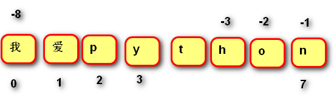 

5. 作用：访问容器元素

6. 语法：容器[整数]

7. 说明：

正向索引从0开始，第二个索引为1，最后一个为len(s)-1

反向索引是从-1开始,-1代表最后一个,-2代表倒数第二个,以此类推。第一个是-len(s)

 

索引不能越界。超出范围

### 切片slice

1. 作用：从容器中取出相应的元素重新组成一个容器。

2. 语法：容器[(开始索引):(结束索引)(:(步长))]

小括号()括起的部分代表可省略          （开始不写默认头，结束不写默认尾，且包含最后一位数

a[int:int]  头尾相同时，为空

 

3. 说明：

结束索引不包含该位置元素

步长是切片每次获取完当前元素后移动的偏移量

 

步鄹：首先找到开始索引 和结束索引的位置，在根据步长方向，推导出切片

第一个字符  容器[0]    容器[-长度]

### **内建函数**

​    len(x)   返回序列的长度

​    max(x)   返回序列的最大值元素

​    min(x)   返回序列的最小值元素

​    sum(x)   返回序列中所有元素的和(元素必须是数值类型)

## **字符串 str**

### **定义**

由一系列字符组成的不可变序列容器，存储的是字符的编码值(2进制)。

### **编码**

代码：day04/code02

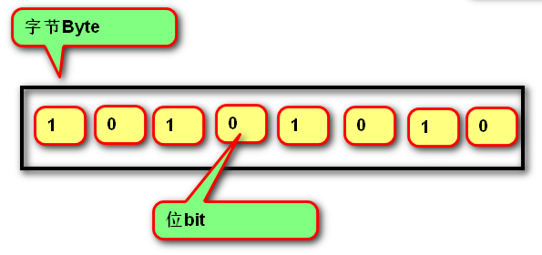 

字节byte(B)：计算机最小存储单位，等于8 位bit（b）. 几位就表示二进制几位数  8位就是11111111  最大数2**8-1=255

字符：单个的数字，文字与符号。

字符集(码表)：存储字符与二进制序列的对应关系。

编码：将字符转换为对应的二进制序列的过程。

解码：将二进制序列转换为对应的字符的过程。

编码方式：

​    1. ASCII编码：包含英文、数字等字符，每个字符1个字节。

​    2. GBK编码：兼容ASCII编码，包含21003个中文；英文1个字节，汉字2个字节。

​    3. Unicode字符集：国际统一编码，旧字符集每个字符2字节，新字符集每个字符4字节。

​    4. UTF-8编码：Unicode的存储与传输方式，英文1字节，中文3字节。 （当前主要使用）

​     注意：用比较简单的话来说就是，Unicode定义了所有可以用来表示字符的数值集合（称 之为Code Point）。UTF-8和UTF-16等UTF标准定义了这些数值和字符的映射关系。

 

#### **相关函数**

​	bin(整数) :将整数转换为二进制字符串

​    hex(整数)：将整数装换成16进制字符串

​	ord(字符串):返回该字符串的Unicode码    （字符变数字）

​	chr(整数):返回该整数对应的字符串

### **字面值**

代码：day04/code03

#### **单引和双引号的区别**

单引号内的双引号不算结束符   (单号里可以包含一个双引号)

双引号内的单引号不算结束符（双引号可以包含一个单引号）    单双不支持换行

#### **三引号作用（三单引号和三双引号）**

换行会自动转换为换行符\n

三引号内可以包含单引号和双引号

作为文档字符串

注意：可见即所得，物理行与逻辑行一样，，怎么输入怎么输出

#### **转义字符**

改变字符的原始含义的特殊字符

\’        \”       \”””      \n  换行     \\     \t 空格      \0  空字符  

如果字符串内部，需要多种（单，双，三）引号时，就用转义符

r  R原始字符串：取消转义。

​	a = r”C:\newfile\test.py”  

​	str02 =r"a\b\c\d.txt"

​	输出的是 a\b\c\d.txt

​	字符串引号最前面加r或者R可以使引号里的转义符失效

#### **字符串格式化**

1. 定义：生成一定格式的字符串。

2. 语法：字符串%(变量)         变量

"我的名字是%s,年龄是%s" % (name, age)

3. 类型码：%s 字符串     %d整数     %f 浮点数

4. 格式：%[- + 0 宽度.精度]类型码

 \-   : 左对齐(默认是右对齐)

 \+   : 显示正号

 0   : 左侧空白位置补零      适用于数字型，整数型%d ，浮点型之类%f

 宽度 : 整个数据输出的宽度

 精度 : 保留小数点后多少位，适用于浮点型

3. 类型码：s 字符串 d 整数   f小数

练习：在控制台中打印时间

120秒显示为：02:00

​	  119           01:59

​	  …..

​      0             00:00

代码：day04/exercise02

 

练习1：在控制台中输入一个很长的字符串，

​	    如果该字符串中包含”qtx”，则提示”老师好”.

练习2：输入一个字符串，打印如下内容。

打印字符串第一个字符

打印字符串最后一个字符串

如果长度是奇数，则打印字符串中间的字符串

len(字符串) 返回长度

练习3：在控制台中输入一个整数，打印一个矩形。

​		例如：4

 		****

​		*  *

\*  *

****

提示：* 乘以 4

​	   中间输出4 - 2空格

练习4：写一个程序，输入一个字符串，把字符串的第一个字符串和最后一个字符去掉。

扩展：输入一个字符串，判断是否为回文。

​	  回文是中心对称的文字。

​	 例如：上海自来水来自海上

​		   山西运煤车煤运西山

## **列表 list**

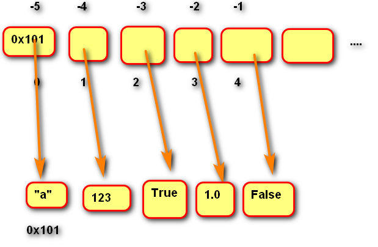 

### **定义**

由一系列变量组成的可变序列容器（可变类型）。        注意存的是变量（对象的地址），注意在内存图里的情况

列表扩容原理：

1.创建新列表（更大的列表）

2.拷贝原有元素

3.替换列表地址

 

### **基础操作**

代码：day04

创建列表：[]         list(可迭代对象)构造函数

​	区别：

​	list1=[]                  list1=  list()               2种创建方式在创造空列表是一样的

lis1=[1,2,3,4]       lisr1=list(k)     k为可迭代对象，，，，‘342343’字符串   range（6）函数等             

 

添加元素：

insert ()插入			

list.insert(index,value)         插入后index后的元素右移

append()末尾追加		list.append(value)  

 

 定位  获取元素：索引   切片       list[index]      list[::]

list[::]   可以先切片来暂时提取部分元素，然后修改切边中的元素，这样原来列表中的切边区域	也是会改变

 

删除元素：remove            list.remove(value)   移除list里第一个找到value

​			  del  a[index]   删除指定索引元素

修改列表：列表[index]=元素

​		            列表[ 切片]= 列表         对列表进行区域赋值

​        遍历元素：  可以获得列表中的元素

​	for   I   in  range(len(list))

​		print(list[i])                        利用range函数的特性 可以指定区域，还能跳着来，改变步长，                         		还能通过正负号来控制遍历方向  以此得到列表中的元素 

for I in    	list

​		print(i)

 

用in  判断list中是否已经存在某个元素用了去重

注意切片放在’=    ‘等号左边还是右边，左边就是原列表切边范围的赋值  本身是一个变量

放右边就是通过对原来列表切片形成一个新的列表。可以赋值给一个变量

 

练习1：体会列表的增删改查。

练习2：在控制台中录入学生成绩

​	  先输入：学生总数

​      再依次录入成绩。

​	  计算总分

代码：day04

 

练习3：在控制台中循环输入整数，存入列表，当输入-1时退出。

​		要求：整数不能相同。

​        计算：最大值、最小值。第二个最大值

​		8  3    2  9  5    

​		2  3  5  8  9

代码：day04

 

### **内存图**

代码：day05

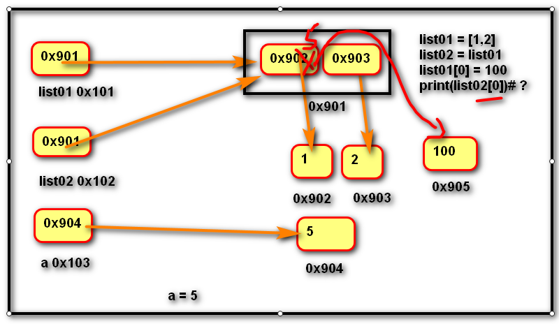 

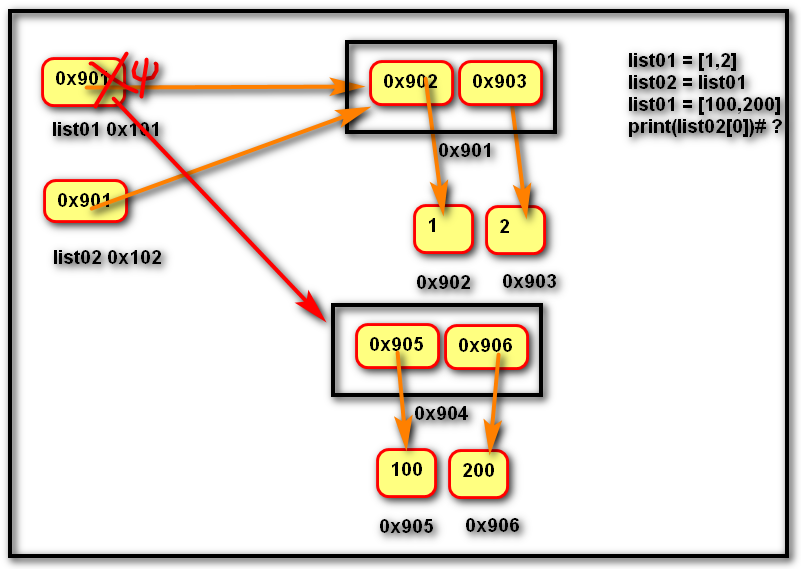 

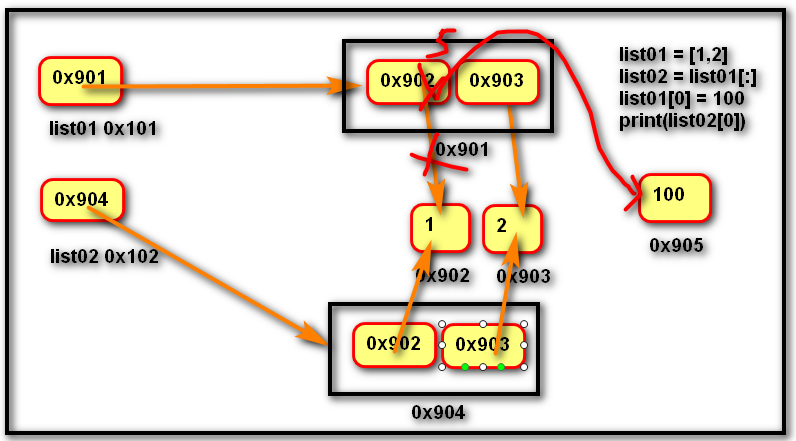 

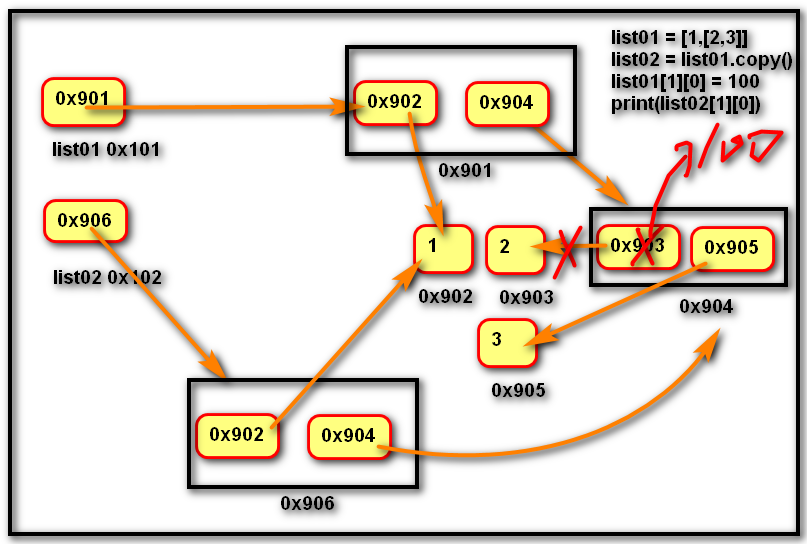 

### **深拷贝和浅拷贝**

浅拷贝：是在复制过程中,只复制一层变量,不会复制深层变量绑定的对象的复制过程。

只是拷贝了对象，指向的对象还是一样的。不过等号赋值和list.copy()方法还是有区别的

copy方法      list[:}切片      copy等同于list[:]                                                  多画图

深拷贝：复制整个依懒的变量。

Deep.copy     就是把整个原来的关系重新复制一份。原来的指向对象也是重新复制了。拷贝后2个东西没有任何关系了已经。相对独立

 

多画图看老师代码

 

等号赋值就是不产生新列表，只是新建一个变量而已，和原来的变量指向同一个列表。列表中的任何变化对两个变量都是一样的

浅拷贝用切片和切片就是产生一个新的列表，但是里面的元素指向关系一样。不过如果原来的列表的指向关系发生变化的话，对第二个列表没有任何影响。如果他们同时指向一个第三个列表时。因为列表是可变的，所以，第一个列表对第三个列表做出改变时，第二个列表里的元素也是指向第三个列表。所以也是会改变了，这种情况和等号赋值就一样了

 

### **扩容原理图**

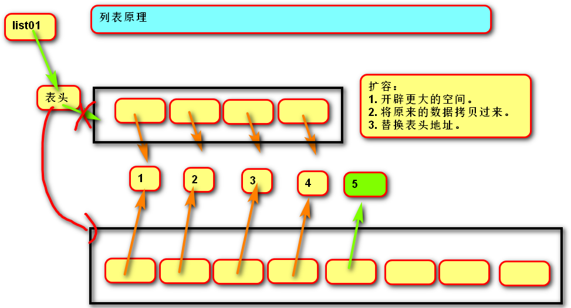 

 

### 列表VS字符串

  代码：day04

1. 列表和字符串都是序列,元素之间有先后顺序关系。

2. 字符串是不可变的序列,列表是可变的序列。   

  3. 字符串中每个元素只能存储字符,而列表可以存储任意类型。

4. 列表和字符串都是可迭代对象。

5. 函数：

 

将多个字符串拼接为一个。

对象1，对象2，对象3，

result = "连接符".join(列表)       列表中的元素也必须为字符串类型

 

将一个字符串拆分为多个。

列表 = “a-b-c-d”.split(“分隔符”)    这个分隔符必须要在前面的字符串里存在。

 

练习1：在控制台中循环输入字符串，待输入q时退出。

​      显示一个新的字符串。

​	代码：day05/ exercise03

 

作业1：单词反转

”How are you”  --> “you are How”

代码：day06/ day05_exercise/ exercise01

作业2：参照字符串与列表文档，自学常用方法。

作业3【扩展】：在控制台中购买彩票

​	一注彩票：7个球(整数)

​	6个红球：1 --- 33  【不能重复】

​	1个蓝球：1 – 16  

​    例如：请输入第1个红球号码：

​		 请输入第2个红球号码：

​		  号码超过范围

​		  已经存在

​	最后输出彩票：红球号码升序排列

代码：day05

 

### **列表推导式**

代码：day05

1. 定义：使用简易方法，将可迭代对象转换为列表。

2. 语法：
    - 变量 = [表达式 (对变量的操作)for 变量 in 可迭代对象]
    - 变量=[(表达式，表达式）for 变量 in  可迭代对象]    这样还能生产其他容器为元素的列表
    - 变量 = [表达式 (对变量的操作) for 变量 in 可迭代对象 if 条件]

3. 说明:如果if真值表达式的布尔值为False,则可迭代对象生成的数据将被丢弃。

List01=[1,2,3,4,5]

list02=[i**2 for  I   in   list01]

list02===>[1,4,9,16,25]

l

### **列表推导式嵌套**

代码 day06/code04

1. 传统写法：

result = []

for r in  ["a", "b", "c"]:

​    for c in ["A", "B", "C"]:

​        result.append(r + c)

2. 推导式写法：

result = [r + c for r in list01 for c in list02]

得到的是一维列表

3. 语法：

[表达式 for 变量1 in 可迭代对象1 for 变量2 in可迭代对象2]

## **元组 tuple**

代码：day05

内存图：

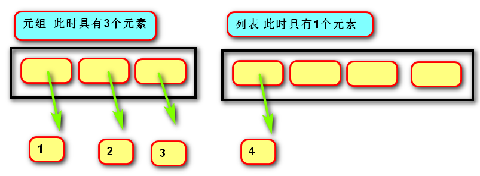 

### **定义**

由一系列变量组成的不可变序列容器。                           

操作 ：类似字符串str  加乘都是形成一个新的元祖，划分新的内存空间    

不可变是指一但创建，不可以再添加/删除/修改元素。

​	内存图里就是固定空间固定元素数量，还有元素的指向对象的地址不能改变    

### **基础操作**

创建空元组：()  tuple()

创建非空元组 t = (20,)

   t = (1, 2, 3)

   t = 100,200,300

tuple(可迭代对象)

获取元素：索引   /切片

练习1：在控制台中输入月，日，计算是这一年的第几天。

代码：day05

练习2：输入月份，显示天数。

代码：day05

### **作用**

元组与列表都可以存储一系列变量，由于列表会预留内存空间，所以可以增加元素。

元组会按需分配内存，所以如果变量数量固定，建议使用元组，因为通常占用空间更小。

应用：

变量交换的本质就是创建元组：x, y = y, x 

格式化字符串的本质就是创建元祖："姓名:%s, 年龄:%d"  % ("tarena", 15)

## **字典 dict**

代码：day05

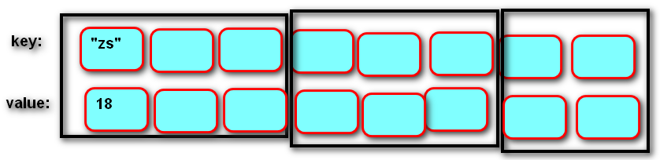 

### **定义**

由一系列键值对组成的可变映射容器。（可变类型）

映射：通过键获取值(字符串/列表/元组通过索引)，每条记录无序。

键必须惟一且不可变(字符串/数字/元组)，值没有限制。

向字典存入（取出）新数据，都需要对key进行哈希运算   记录key大概位置（目的快速运算）

​	

### **基础操作**

创建字典：{键1：值1，键2：值2}  

  dict (可迭代对象)    注意：

添加/修改元素：

语法:

​    字典[键] = 数据

说明:

​    键不存在,创建键,并绑定键对应的值。

​    键存在,修改绑的绑定关系。

获取元素：v = 字典[键] # 没有键则错误      建议先判断是否存在，再进行读取

删除元素：del 字典[键]

 

成员运算符  in   是判断字典中是否存在这个键 

 

遍历： for   key  in  dict:

​				dict[key]

​		   for   k ,v   in   dict.items()

​				print(k,v)        直接遍历键和值       k为键      v  为值

 

dict.items   生产以每对键和值的关系生产一个长度为2的元祖为一个元素的可迭代对象     

dict.keys     生成以每个键为元素的可迭代对象

dict.values   生成以每个值为元素的可迭代对象

​				

dict.get(key[,value])    返回key对应的值，如果值不存在或者这个字典中没有这个键就会返回value 的值，value可以不写，默认为None；

dict.setdefault(key[,defualt=None])    	

 

作业1：在控制台获取季度，返回月份。

​	  key          value

​	  “春”    “1月2月3月”

 

作业2：在控制台中获取一段文字，

打印这个文字中出现的字符以及次数。

“abcaabcd”

a   3

b   2

c   2

d   1

扩展作业：

游戏：      石头    剪刀   布

在控制台中获取：0    1    2，代表石头剪刀布。

根据游戏规则，显示：平局、胜利、失败。

提示：import  random

​      random.randint(0,2)

​	  将胜利策略存入元组

​	  (

​      (“石头”,”剪刀”),

​      (“剪刀,”布”),

(“布”,”石头”)

​	  )

将用户输入的与系统生成的结果

（"    ”   ，”   ”）in 胜利策略

代码：day05_exercise/ exercise 01

### **字典推导式**

定义：使用简易方法，将可迭代对象转换为字典。

​		可以先做for循环，在改成推导式

  	语法:

{键表达式	:值表达式 for 变量 in 可迭代对象}

​                    {键表达式:值表达式 for 变量 in 可迭代对象 if 条件}

 

​		

### **字典** **VS** **列表**

1. 都是可变容器。

2. 获取元素方式不同,列表用索引,字典用键。

3. 字典的插入,删除,修改的速度快于列表。

4. 列表的存储是有序的,字典的存储是无序的。

  

容器总结          		存储元素	

 	字符串：		字符	   	不可变	序列

​	 列表		变量	   	可变		序列

​	 元组		变量	   	 不可变	序列

​	 字典		键值对	可变		映射

​	 集合	不可变变量	可变		映射

 

 

## **集合 set**

代码：day06

### **定义**

由一系列不重复的不可变类型变量组成的可变映射容器（可变类型）。（表示里面元素要求为不可变类型如：列表不行，可以放元组）

相当于只有键没有值的字典(键则是集合的数据)。（无序）

 

内存图：

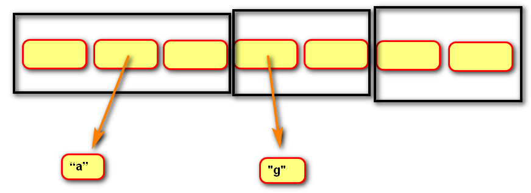 

### **基础操作**

创建空集合： set()  set(可迭代对象)    不要用{}来创建空集合，这样系统默认为字典

创建具有默认值集合：{1, 2, 3}  set(可迭代对象)

添加元素：set.add(value)

删除元素：set.remove(value)    这个和字典一样不过在删之前要确定集合里面存在该元素，不	然就报错

推荐使用		删除set.discard(value)      随便使用，value不存在也不会报错

获取元素：只能遍历		

### **运算**

  交集&, 并集|, 补集-, 对称补集^, 子集<   超集>

& 生成两个集合的交集  返回共同元素

  s1 = {1, 2, 3}

  s2 = {2, 3, 4}

  s3 = s1 & s2  # s3 = {2, 3}

 

| 生成两个集合的并集  返回所有不重复元素就是+加号

  s1 = {1, 2, 3}

  s2 = {2, 3, 4}

  s3 = s1 | s2  # s3 = {1, 2, 3, 4}

 

\- 生成两个集合的补集   返回只属于其中之一的元素就是－减号

  s1 = {1, 2, 3}

  s2 = {2, 3, 4}

  s1 - s2  # {1}, 生成属于s1,但不属于s2的所有元素的集合

 

^ 生成两个集合的对称补集  返回不同的的元素

  s1 = {1, 2, 3}

  s2 = {2, 3, 4}

  s3 = s1 ^ s2  # {1, 4} # 等同于(s1-s2 | s2-s1)

 

< 判断一个集合是另一个集合的子集    小于

\> 判断一个集合是另一个集合的超集    大于

  s1 = {1, 2, 3}

  s2 = {2, 3}

  s1 > s2  # True

  s2 < s1  # True

 

== != 集合相同或不同

  s1 = {1, 2, 3}

  s2 = {3, 2, 1}

  s1 == s2  # True

  s1 != s2  # False

<=  >= 子集或相同,超集或相同

  

特别注意：除了这上面的运算，其他类似 +   *    *=    +=    等其他容器可以使用的数学操作都不能使用，同理字典也不行

### **集合推导式**

 定义：使用简易方法，将可迭代对象转换为集合。

  	 语法:

{表达式 for 变量 in 可迭代对象}           通过括号看类型

​         {表达式 for 变量 in 可迭代对象 if 条件}

## **固定集合 frozenset**

### **定义**

不可变的集合。

#### **作用**

固定集合可以作为字典的键,还可以作为集合的值。

编程思想：凡是不对容器进行增减修改的容器，尽量使用元组或者固定集合

#### **基础操作**

  创建固定集合：frozenset(可迭代对象)

#### **运算**

等同于set

 

练习1：

   在控制台中循环输入内容.如果录入空字符串，则退出。

   统计输入次数，打印不重复的内容。

​     “a"  "b"   "a"

​     3次    a   b  a

代码：day06

练习2：    

经理：[曹操,刘备,孙权]。 技术员：[曹操,刘备,张飞,关羽]。

​    使用两个列表分别存储经理与技术员。

​    使用集合计算：

​    \1. 即是经理也是技术员的有谁？

​    \2. 是经理，但不是技术员都有谁？

​    \3. 是技术员，但不是经理都有谁？

​    \4. 张飞是经理吗？

​    \5. 身兼一职的都有谁？

​    \6. 经理和技术员共有几个人？

代码：day06

 

作业1：实现两个列表元素的全排列

[“香蕉”,”苹果”,”哈密瓜”, ”草莓”]

[“牛奶”,”咖啡”,”雪碧”]

作业2：在控制台中录入学生信息name,age,score

​	   将每个学生输出到控制台(一个学生一行)

数据结构：

[

{

“name”:”zs”,

”age”:25,

”score”:100, 

},

{

“name”:”ls”,

”age”:35,

”score”:80, 

}

 ]

扩展作业:设计一个算法，判断列表中是否具有相同元素。

  	  [1,4,7,5,1,9,8]

 

# 函数 function

## **pycharm相关设置**

\1. “代码自动完成”时间延时设置

   File -> Settings  -> Editor -> General -> Code Completion

   -> Autopopup in (ms):0

\2. 快捷键：

Ctrl + P    参数信息（在方法中调用参数）

Ctrl + Q    快速查看文档

Ctrl + Alt + M提取方法     （活用）直接生产方法带参数，名字

shift+f6 全部改名

## **定义**

代码day06

用于封装一个特定的功能，表示一个功能或者行为。

函数是可以重复执行的语句块, 可以重复调用。

## **作用**

提高代码的可重用性和可维护性（代码层次结构更清晰）。

## **定义函数**

\3. 语法：

def 函数名(形式参数):                         对象

​     函数体

\4. 说明：

-- def 关键字：全称是define，意为”定义”。对象

-- 函数名：对函数体中语句的描述，规则与变量名相同。  多用动词

-- 形式参数：方法定义者要求调用者提供的信息。

-- 函数体：完成该功能的语句。

\5. 函数的第一行语句可以选择性地使用文档字符串存放函数与参数的说明。

\6. 方法体的代码尽量别超10行

 

## **调用函数**

\5. 语法：函数名(实际参数) 

\6. 说明：根据形参传递内容。

## **返回值**

\5. 定义：方法定义者告诉调用者的结果。

\6. 语法：return [表达式] 

\7. 说明：

-- 表达式就是需要返回的结果。

-- 不带表达式的return相当于返回 None。

-- 不带return语句，函数执行完后返回None

(相当于在最后加了一条return None语句)

特别注意： 执行完return后，退出方法

## 可变／不可变类型在传参时的区别

代码 day07

\1. 不可变类型参数有:

数值型(整数，浮点数,复数)

布尔值bool

None 空值

字符串str

元组tuple

固定集合frozenset

\2. 可变类型参数有:

列表 list

字典 dict

集合 set

字节数组 bytearray

\3. 传参说明：

不可变类型的数据传参时，函数内部不会改变原数据的值。

可变类型的数据传参时，函数内部可以改变原数据。（意味着可变也可以不变）

了解内存图，多看看内存图

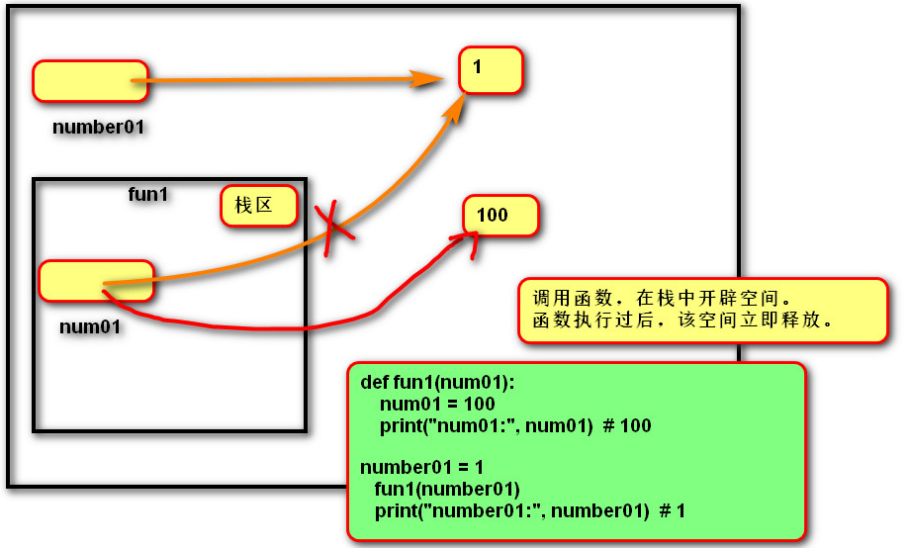 

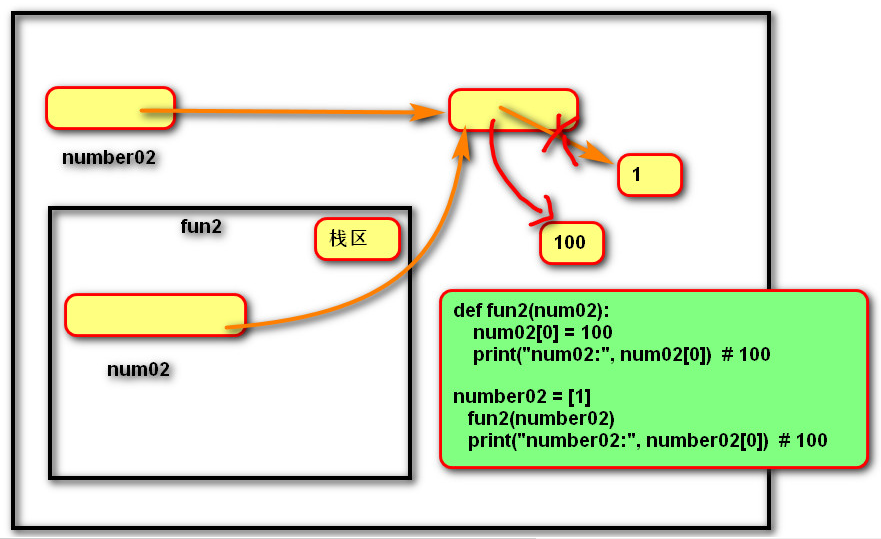 

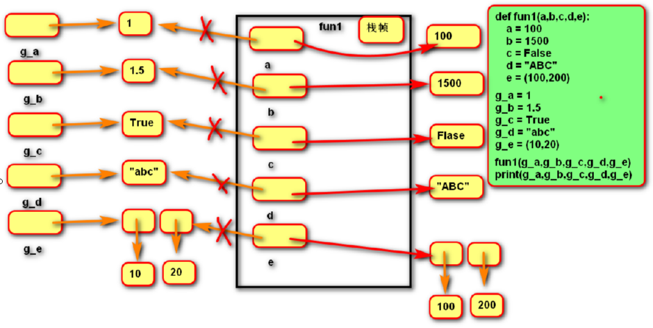 

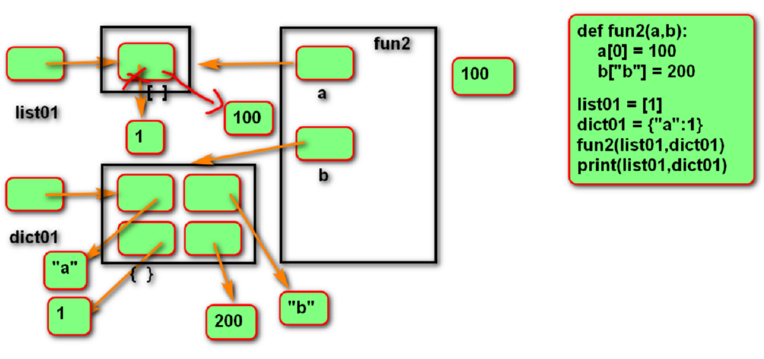 

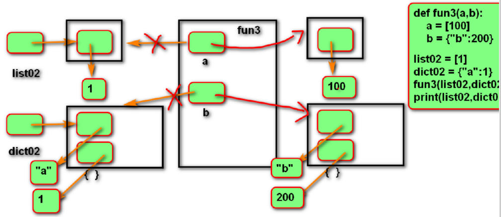 

## **函数参数**

参数：变量

函数调用者     	告诉	函数定义者的信息

 

### **实参传递方式****argument**

#### **位置传参**   

代码day07  s_code07

定义：实参与形参的位置依次对应。

 Def  fun01(a,b,c):

​	print(a)

​	print(b)

​	print(c)  

*#**位置传参：实参和形参的位置依次对应*

fun01(1,2,3)    *#==>1    2    3*

*根据顺序填写*

##### **序列传参**

定义：实参用*将序列拆解后与形参的位置依次对应。

可以在运行时，根据某些逻辑决定传入的数据（列表）

*#**序列传参：用*****将序列拆分后与形参的位置依次对应  属于位置传参*

fun01(*[4,5,6]) *# ==**》**4   5    6*

*fun01(\*{**1**,**2**,**3**})  #==>  1   2   3    字典和集合都可以*

#### **关键字传参**

定义：实参根据形参的名字进行对应。

*#**关键字传参**:* *实参根据形参的名称进行对应*

fun01(1,c=3,b=2)   *#===>1   2  3*

*fun01(1,2,a=3)    #====>**报错*

*fun01(1,b=2,a=3)  #===> 报错*   

*fun01(a=1,2,3)  #===>报错    首个参数用关键字后面的参数也必须使用关键字*

 

 

##### **字典关键字传参**

\1. 定义：实参用**将字典拆解后与形参的名字进行对应。

\2. 作用：配合形参的缺省参数，可以使调用者随意传参。

​         可以在运行时，根据某些逻辑决定传入的数据（列表）

*#**字典传参：   用******将字典拆分后与形参的名字进行对应，也关键字传参*

fun01(**{**'a'**:1,**'b'**:2,**'c'**:3})  *# ==> 1    2    3*

*等价于*fun01(a=1,b=2,c=3)

 

 

 

### **形参定义方式****parameter**

#### **缺省参数(默认参数）**

\1. 语法：

def 函数名(形参名1=默认实参1, 形参名2=默认实参2, ...):

​    函数体

\2. 说明：

-- 缺省参数必须自右至左依次存在，如果一个参数有缺省参数，则其右侧的所有参数都必须有缺省参数。

fun(a=0,b,c=0)    #报错 			fun(a,b,c=0)   正确

-- 缺省参数可以有0个或多个，甚至全部都有缺省参数。

好处：让调用者者有选择性的传递需要的信息

 

关键字传参和默认传参相结合，可以让调用者只传参自己需要的信息

def  fun02(a=0,b=0,c=0):

​	print(a)

​	print(b)

​	print(c)

*默认参数：不写参数，使用默认值*  

*fun02()  #==>  0    0    0*

*fun02(\*[2,3])      #====>2    3     0*

*un02(b=20)        #====》>0    20    0*

*fun02(**{'c':"c"})   #===> 0     0    c*

*fun02(2)     ====>  2   0    0  先给左边的参数*

 

 

 

 

 

 

#### **位置形参**

\1. 语法：

def 函数名(形参名1, 形参名2, ...):

函数体

fun(a,b,c)     最普通那种

##### **星号元组形参**

\1. 语法：

def 函数名(*args):		不定长参数，可以是无数个

  函数体

\2. 作用：收集多余的位置传参。让实参数量无限		得到的参数放到一个元祖里

\3. 说明：

-- 一般命名为'args'

-- 形参列表中最多只能有一个

 

def fum(a,b,*args):

​		print(args)        

​		return sum(args)

fum(1,2,3,4) ===>打印结果(3,4)     返回  7    

**def** fum(*args):

​    		**return** sum(args)

​	print(fum(1,2,3,4))==》10

 

 

 

#### **命名关键字形参**

\2. 语法：

def 函数名(*, 命名关键字形参1, 命名关键字形参2, ...):

函数体

def 函数名(*args, 命名关键字形参1, 命名关键字形参2, ...):
                      函数体

fun(*,a,b)===>fun(a=1,b=1)     只有当使用a,b关键字时才有效。不然报错

\3. 作用：强制实参使用关键字传参    

##### **双星号字典形参**

\1. 语法：

def 函数名(**字典形参名):

 	 函数体

def fun(**kwargs):

​		print(kwargs)

fun(a=1,b=2)   ===>  {a:1,b:2}

\2. 作用：收集多余的关键字传参

\3. 说明:

-- 一般命名为'kwargs'

-- 形参列表中最多只能有一个

就是特殊的命名关键字形参，函数使用者可以无限传入，关键字参数。

#### **参数自左至右的顺序**

位置形参 --> 星号元组形参 --> 命名关键字形参 --> 双星号字典形参

fun(1,2,3)      fun(*args)        fun(*,a,b) fun(*args,a)      fun(**kwargs)

# **作用域****LEGB**

代码day07

\1. 作用域：变量起作用的范围。

\2. Local局部作用域：函数内部。

\3. Enclosing  外部嵌套作用域 ：函数嵌套。 

\4. Global全局作用域：模块(.py文件)内部。 

\5. Builtin内置模块作用域：builtins.py文件。

## **变量名的查找规则**

由内到外：L -> E -> G -> B          就近原则

在访问变量时，先查找本地变量，然后是包裹此函数外部的函数内部的变量，之后是全局变量，最后是内置变量。

## **局部变量**

定义在函数内部的变量(形参也是局部变量)

只能在函数内部使用

调用函数时才被创建，函数结束后自动销毁

## **全局变量**

定义在函数外部,模块内部的变量。

在整个模块(py文件)范围内访问（但函数内不能将其直接赋值可以读）。

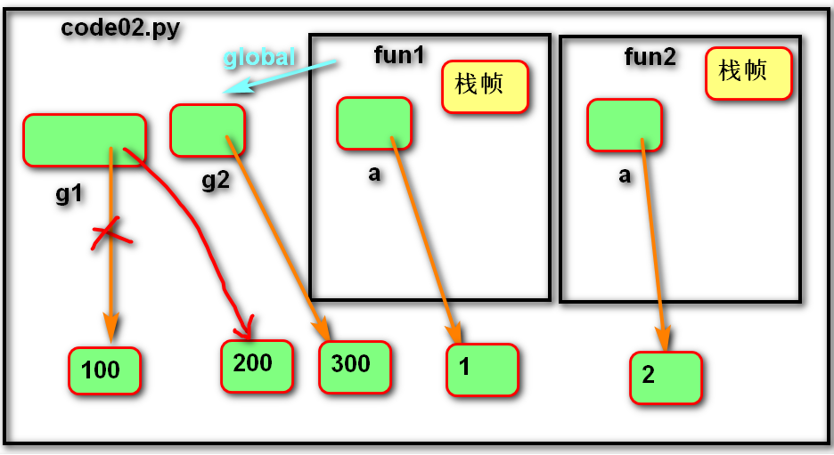 

## **global 语句**

**1．** 作用：

-- 在函数内部修改全局变量。

-- 在函数内部定义全局变量(全局声明)。（要方法调用后才生效）

**2．** 语法

global 变量1, 变量2,…

变量1赋值       

声明和赋值分2步

 

**3．** 说明

-- 在函数内直接为全局变量赋值，视为创建新的局部变量。（不用global的情况下）

-- 不能先声明局部的变量，再用global声明为全局变量。

## **nonlocal 语句**

\1. 作用：在内层函数修改外层嵌套函数内的变量

\2. 语法

nonlocal 变量名1,变量名2, ...

\3. 说明

在被嵌套的内函数中进行使用