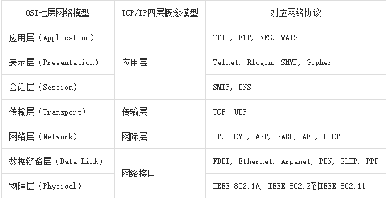

# **IO网络编程**

## **IO**

1.**定义**

在内存中存在数据交换的操作认为是IO操作,比如和终端交互 ,和磁盘交互，和网络交互等

2.**程序分类**

- IO密集型程序：在程序执行中有大量IO操作，而cpu运算较少。消耗cpu较少，耗时长。

- (cpu)计算密集型程序：程序运行中计算较多，IO操作相对较少。cpu消耗多，执行速度快，几乎没有阻塞(如input函数，需要输入后程序才能进行执行)。

## **文件**

文件是保存在持久化存储设备(硬盘、U盘、光盘..)上的一段数据。从功能角度分为文本文件（打开后会自动解码为字符）、二进制文件(视频、音频等)。在Python里把文件视作一种类型的对象，类似之前学习过的其它类型。

### **字节串（bytes）**

在python3中引入了字节串(python独有)的概念，与str不同，字节串以字节序列值表达数据，更方便用来处理二进程数据。因此在python3中字节串是常见的二进制数据展现方式。

* 字节就是表示机器码，计算机用怎样的形式来存储数据，并且可以通过字节数来观察存储大小

- 普通的ascii编码字符串可以在前面加b转换为字节串，

- ascii的字节串就是原有字符加单引号前面加b例如：b'hello'

- 其他如汉字就是得到3组2位16位进制的数表示一个字节的序列，Python中用16进制表示2进制数，一个16进制数8位，2个一共16位代表一个字节，py中一个汉字存储大小为3字节

  ```python
  str=’你好’ print(str.encode())  
  
  b'\xe4\xbd\xa0\xe5\xa5\xbd'  #   6组 一共6字节大小
  ```

**字符串转换为字节串方法** ：encode()

**字节串转换为字符串方法** : decode()

### **文件读写**

对文件实现读写的基本操作步骤为：打开文件，读写文件，关闭文件

代码实现： day5/file_open.py
代码实现： day5/file_read.py
代码实现： day5/file_write.py

代码实现：day5/file_binary_read.py

代码练习实例：day5/copy_file.py  文件复制   重点

1.**打开文件**

```python
file_object = open(file_name, access_mode='r', buffering=-1)

功能：打开一个文件，返回一个文件对象。

参数：file_name————文件名；也可以可以是路径的方式

     access_mode————打开文件的方式,如果不写默认为‘r’ 

          文件模式                        操作

              r                    以读方式打开 文件必须存在，光标在文件开头 文件名不能有后缀

		不存在就报错FileNotFoundError，open代码放到try语句中

              w                    以写方式打开

                         文件不存在则创建，存在清空原有内容 文件名可以有后缀

              a                    以追加模式打开 同w 只是这个不删除原内容，文件不存在则  										创建，光标位置在内容结尾 文件名可以有后缀

              r+                   以读写模式打开 文件必须存在，其他同r

              w+                   以读写模式打开文件  同w

                                   不存在则创建，存在清空原有内容

              a+                   以读写模式打开 追加模式  同a

              rb                   以二进制读模式打开 同r   读出来内容是字节串

              wb                   以二进制写模式打开 同w

              ab                   以二进制追加模式打开 同a

              rb+                  以二进制读写模式打开 同r+

              wb+                  以二进制读写模式打开 同w+

              ab+                  以二进制读写模式打开 同a+


```

​    

音频图片等2进制文件要以二进制模式打开(后面加b)

**注意**：如果open打开文件的方式中有b，表示以二进制打开，此时就要以字节串的形式读出和写入  +b 可以打开和读取，写入任意形式的文件。

```
	buffering————参数0表示无缓冲(linux系统Py不行)，1表示有行缓冲(遇到换行\n就和磁盘交互)，如果是大于1标识直接指明缓冲区大小(字节多少)。如果不写或为负数则表示使用系统默认提供的缓冲机制（一般比较大）。
```

**代码实现 day05 buffer.py**

返回值：成功返回文件流对象。失败得到IOError。

 

**缓冲系统**自动的在内存中为每一个正在使用的文件开辟一个缓冲区，从内存向磁盘输出数据必须先送到内存缓冲区，装满缓冲区在一起送到磁盘中去。从磁盘中读数据，则一次从磁盘文件将一批数据读入到内存缓冲区中，然后再从缓冲区逐个的将数据送到程序的数据区。

缓冲区作用：减少和磁盘的交互次数，提高磁盘读写效率

当文件close 或者程序结束时，就会刷新缓冲区即和磁盘进行交互。写入时就是把缓冲区的内容写入磁盘

 

#### **@** **扩展延伸：文件流**

代码实现： day1/stdin.py

**流**（**stream**）：所有的I/O操作仅是简单的从程序移进或者移出，这种字节流，就称为流。所以打开一个文件有时也称为打开一个文件流对象

系统已经默认为我们打开了三个流，在sys模块中：

```
标准输入————sys.stdin         input  就是 sys.stdin.readline()`

标准输出————sys.stdout`

标准错载————sys.stderr`
 
```

**1.读取文件**

**read([size])**
用来直接读取字节到字符串中，最多读取给定数目个字节。如果没有给定size参数（默认值为-1）或者size值为负，文件将被读取直至末尾。文件过大时候建议在non-blocking（非阻塞）模式下使用。

**注意事项：**

1. 不加参数表示读到文件末尾，如果文件过大不建议这么操作，会消耗大量内存，读取时间也会更长，
2. 如果读取到文件结尾再读取会得到空字符串
3. 实际读取到的内容可能小于等于指定的size大小

**readline([size])**
读取打开文件的一行(读取到结束符(换行符\n)之前的所有字节)。然后整行，包括行结束符(\n)，作为字符串返回。和 read() 相同，它也有一个可选的 size 参数，默认为 -1，代表读至行结束符。如果提供了该参数，那么在超过size个字节后会返回不完整的行。

 

**readlines([sizeint])**
该方法并不像其它两个输入方法一样返回一个字符串。它会读取所有(剩余的)行然后把它们作为一个字符串列表返回。它的可选参数**sizhint**代表返回的最大字节大小。 

**注意事项：**

​		1.这里读取的每行内容会以一个列表元素存在，包括换行符\n也会被显示在内容中看到

​		2.如果写**sizhint**  参数，**sizhint** 不足一行也会得到整行内容 

  **另类读取**

文件对象本身也是一个可迭代对象，在for循环中可以迭代文件的每一行。 

```python
for line in f:
    print(line)
```

**3.写入文件****

**write(string)**
功能与 read() 和 readline() 相反。它把含有文本数据或二进制数据块的字符串写入到文件中去。

注意事项：如果想换行需要人为添加换行符

**writelines(str_list)**
和 readlines() 一样，writelines()方法是针对列表的操作，它接受一个字符串列表作为参数，将它们写入文件。行结束符并不会被自动加入，所以如果需要的话，你必须在调用writelines()前给每个列表元素结尾加上行结束符。

**4.关闭文件****

打开一个文件后我们就可以通过文件对象对文件进行操作了，当操作结束后使用close（）关闭这个对象可以防止一些误操作，也可以节省资源。就是对对象的销毁

```
file_object.close()
```

**5.with操作***

python中的with语句使用于对资源进行访问的场合，保证不管处理过程中是否发生错误或者异常都会执行规定的“清理”操作，释放被访问的资源，比如有文件读写后自动关闭、线程中锁的自动获取和释放等。

```python
#with语句的语法格式如下：

with context_expression [as target(s)]:

​    with-body（语句块）

context_expression是 表达式  as 后面为变量名    ===》》 变量名 = 表达式  
```

通过with方法可以不用close(),因为with生成的对象在语句块结束后会自动处理，所以也就不需要close了，但是这个文件对象只能在with语句块内使用。

```python
with open('file','r+') as f: ===>   f=open('file','r+')

    f.read()
```

**注意事项：**目前为止就文件对象可以使用with语句

### **其他操作**

#### **刷新缓冲区**

代码实现： day5/buffer.py

**flush()**    文件对象的方法    文件对象名.flush()
该函数调用后会立即刷新缓冲区进行一次磁盘交互，将缓冲区中的内容写入到磁盘。

 

#### 文件偏移量(光标指针)

代码实现： day05/seek.py

**1.定义**

打开一个文件进行操作时系统会自动生成一个记录，记录中描述了我们对文件的一系列操作。其中包括每次操作到的文件位置。文件的读写操作都是从这个位置开始进行的。

功能：代表文件的当前读写操作位置，随读写操作移动

1. r w 方式打开文件此时偏移量在开头

2. 以a 方式打开此时偏移量在末尾

**2.基本操作**

```
tell()**
功能：获取文件当前偏移量

返回一个数字表示相对开头经历了多少个字节（换行符\n  是一个字节大小）
```

 

```
seek(offset[,whence])**
功能:移动文件位置
必写参数：offset(int类型)字节    代表相对于某个位置偏移量。正数向后移动，负数表示向前移动。
可选参数：whence是基准位置的默认值为 0，代表从文件开头算起，1.代表从当前位置算起，2. 代表从文件末尾算起。 whence为1,2 时，offset值只能为0，用来调整光标位置。

当以二进制模式打开时(b),whence为1,2 时，可以使用任意offset 值 
```

#### **文件描述符**

**1.定义**

系统中每一个IO操作都会分配一个整数作为编号（不会重复），该整数即这个IO操作的

每一次open 操作得到一个编号，通过这个文件对象的操作都是同一个编号

如果再次 进行 open 操作 就会再次得到一个编号

文件描述符。

**2.获取文件描述符**

**fileno()**
通过IO对象获取对应的文件描述符 （编号）

### **文件管理函数**

```python
Py中使用前导入os模块

1.获取文件大小

os.path.getsize(file)

2.查看文件列表

os.listdir(dir)

4.查看文件是否存在

os.path.exists(file)

5.判断文件类型        （普通文件还是目录文件)

os.path.isfile(file) 		是否为普通文件    linux终端里 ls -l  首字母为  -

os.path.isdir(file)		是否为目录文件						     为  d

6.删除文件

os.remove(file)    删除普通文件，不能是目录文件
```

##  

## **网络编程基础**

计算机网络功能主要包括实现资源共享，实现数据信息的快速传递。

### **OSI七层模型**

制定组织： ISO（国际标准化组织）

**作用：使网络通信工作流程标准化**

- 应用层 ： 提供用户服务，具体功能有应用程序实现       各种软件
  表示层 ： 数据的压缩优化加密     					   加密打包
  会话层 ： 建立用户级的连接，选择适当的传输服务
  传输层 ： 提供传输服务
  网络层 ： 路由选择，网络互联
  链路层 ： 进行数据交换，控制具体数据的发送
  物理层 ： 提供数据传输的硬件保证，网卡接口，传输介质 

**优点**

1. 建立了统一的工作流程

2. 分部清晰，各司其职，每个步骤分工明确

3. 降低了各个模块之间的耦合度，便于开发

###   

### 四层模型（TCP/IP模型)

背景 ： 实际工作中工程师无法完全按照七层模型要求操作，逐渐演化为更符合实际情况的四层

  

####  

#### **数据传输过程**

1.发送端由应用程序发送消息，逐层添加首部信息(和协议有关)，最终在物理层发送消息包。

2.发送的消息经过多个节点（交换机，路由器）传输，最终到达目标主机。

3.目标主机由物理层逐层解析首部消息包，最终到应用程序呈现消息。

 

#### **网络协议**

在网络数据传输中，都遵循的**规定**，包括建立什么样的数据结构，什么样的特殊标志等。

不同应用不同协议，觉得首部信息

### **网络基础概念**

```
 网络主机（host）

功能：标识一台主机在网络中的位置（地址）

本地地址 ： 'localhost' , '127.0.0.1'
网络地址 ： '172.40.91.185'
自动获取地址： '0.0.0.0'     

查看本机网络地址命令： ifconfig

· IP地址

功能：确定一台主机的网络路由位置

结构

IPv4 点分十进制表示 172.40.91.185 每部分取值范围0--255
IPv6 128位 扩大了地址范围

特殊IP

127.0.0.1 本机测试IP
0.0.0.0 自动获取本机网卡地址
172.40.91.0 通常表示一个网段
172.40.91.1 通常表示一个网关
172.40.91.255 用作广播地址     最后一位为最大值

域名

定义： 给网络服务器地址起的名字 俗称网址

作用： 方便记忆，表达一定的含义

ping [ip] : 测试和某个主机是否联通     ping 域名 可以得到ip 地址

端口号（port）

作用：端口是网络地址的一部分，用于区分主机上不同的网络应用程序。

特点：一个系统中的应用监听端口不能重复

取值范围： 1 -- 65535

1--1023 系统应用或者大众程序监听端口
1024--65535 自用端口
```

## **传输层服务**

### **面向连接的传输服务（基于TCP协议的数据传输重点**

1.传输特征 ： 提供了可靠的数据传输，可靠性指数据传输过程中无丢失，无失序，无差错，无重复。

2.实现手段 ： 在通信前需要建立数据连接，通信结束要正常断开连接。

三次握手（建立连接）

客户端向服务器发送消息报文请求连接
服务器收到请求后，回复报文确定可以连接
客户端收到回复，发送最终报文连接建立

 

 

四次挥手（断开连接）

主动方发送报文请求断开连接
被动方收到请求后，立即回复，表示准备断开
被动方准备就绪，再次发送报文表示可以断开
主动方收到确定，发送最终报文完成断开

 

3.适用情况 ： 对数据传输准确性有明确要求，传数文件较大，需要确保可靠性的情况。比如：网页获取，文件下载，邮件收发。

### 面向无连接的传输服务（基于UDP协议的数据传输）

1.传输特点 ： 不保证传输的可靠性，传输过程没有连接和断开，数据收发自由随意。

2.适用情况 ： 网络较差，对传输可靠性要求不高。比如：网络视频，群聊，广播

面试要求

· OSI七层模型介绍一下，tcp/ip四层模型是什么？

· tcp服务和udp服务有什么区别？  可靠性不同

· 三次握手和四次挥手指什么，过程是怎样的？

· 建立连接      断开连接

· 

## **socket套接字编程**

### **套接字介绍**

1.套接字 ： 实现网络编程进行数据传输的一种技术手段

2.Python实现套接字编程：import socket

3.套接字分类

流式套接字(SOCK_STREAM): 以字节流（流水）方式传输数据，实现tcp网络传输方案。(面向连接--tcp协议--可靠的--流式套接字)

数据报套接字(SOCK_DGRAM):以数据报（打包）形式传输数据，实现udp网络传输方案。(无连接--udp协议--不可靠--数据报套接字)

### **tcp****套接字编程**

#### **服务端流程**


代码实现：day06/tcp_server.py

1.创建套接字

sockfd=socket.socket(socket_family=AF_INET,socket_type=SOCK_STREAM,proto=0)

前面socket 为模块名，第二个为模块中的类名  模块中，名字全为大写的是常量

功能：创建套接字

参数：  socket_family  网络地址类型 AF_INET表示ipv4

 socket_type  套接字类型 SOCK_STREAM 流式（默认）         SOCK_DGRAM 数据报

​        proto  通常为0  选择子协议   应用层无用，不用改

返回值： 套接字对象

2.绑定地址

sockfd.bind(addr)

功能： 绑定本机网络地址   

参数： 二元元组 (ip,port（端口号）)  ('0.0.0.0',8888)   IP地址字符串类型 四个0别人随意访问 本地地址就是只能自己访问

 端口  整型类型 

3.设置监听

sockfd.listen(n)    和客户端建立连接

功能 ： 将套接字设置为监听套接字，确定监听队列大小 一般为5   监听多个客户端

参数 ： 监听队列大小（**Linux系统写多少都一样，系统默认决定**）      多个客户端发起连接时，按队列形式确定顺序

4.等待处理客户端连接请求

connfd,addr = sockfd.accept()

功能： 阻塞等待处理客户端请求

返回值： connfd  客户端连接套接字

​         addr  连接的客户端地址

5.消息收发

data = connfd.recv(buffersize)

功能 : 接受客户端消息

参数 ：每次最多接收消息的大小

返回值： 接收到的内容   bytes格式

n = connfd.send(data)

功能 : 发送消息

参数 ：要发送的内容  bytes格式

返回值： 发送的字节数

6.关闭套接字

sockfd.close()          主套接字最后关闭，单个客服套接字先关闭

功能：关闭套接字

#### **客户端流程**

代码实现：day06/tcp_client.py

 

1.创建套接字

注意:只有相同类型的套接字才能进行通信

2.请求连接

sockfd.connect(server_addr)

功能：连接服务器

参数：元组  服务器地址

3.收发消息

注意： 防止两端都阻塞，recv send要配合，如果服务器先发送，客户端则先接收

 

4.关闭套接字

#### **tcp** **套接字数据传输特点**

· tcp连接中**当一端退出**，另一端如果阻塞在recv，此时recv会立即返回一个空字串。

· tcp连接中如果一端已经不存在，仍然试图通过send发送则会产生BrokenPipeError   （管道破裂异常  连接异常中断）

· 一个监听套接字可以同时连接多个客户端，也能够重复被连接

#### **网络收发缓冲区**

1.网络缓冲区有效的协调了消息的收发速度

2.send和recv实际是向缓冲区发送接收消息，当缓冲区不为空recv就不会阻塞。

#### **tcp****粘包**

原因：tcp以字节流方式传输，没有消息边界。多次发送的消息被一次接收，此时就会形成粘包。

影响：如果每次发送内容是一个独立的含义，需要接收端独立解析此时粘包会有影响。

处理方法

\1. 人为的添加消息边界

\2. 控制发送速度

 

 

 

### **UDP****套接字编程**

#### **服务端流程**


代码实现：day06/udp_server.py

1.创建数据报套接字

sockfd = socket(AF_INET,SOCK_DGRAM)

2.绑定地址

sockfd.bind(addr)

3.消息收发

data,addr = sockfd.recvfrom(buffersize)

功能： 接收UDP消息

参数： 每次最多接收多少字节

返回值： data  接收到的内容

​        addr  消息发送方地址

 

n = sockfd.sendto(data,addr)

功能： 发送UDP消息

参数： data  发送的内容 bytes格式

​        addr  目标地址

返回值：发送的字节数

4.关闭套接字

sockfd.close()

#### **客户端流程**


代码实现：day06/udp_server.py

1.创建套接字

2.收发消息

3.关闭套接字

 

总结 ：tcp套接字和udp套接字编程区别

\1. 流式套接字是以字节流方式传输数据，数据报套接字以数据报形式传输

\2. tcp套接字会有粘包，udp套接字有消息边界不会粘包

\3. tcp套接字保证消息的完整性，udp套接字则不能

\4. tcp套接字依赖listen accept建立连接才能收发消息，udp套接字则不需要

\5. tcp套接字使用send，recv收发消息，udp套接字使用sendto，recvfrom

 

### **socket****模块方法和****socket****套接字属性**

1.部分**socket****模块**方法

 【1】 gethostname()  获取计算机名 一般返回用户名

 【2】 gethostbyname('www.baidu.com')  获取主机ip地址

 【3】 getservbyname('mysql') 获取服务端口号

 【4】 getservbyport(3306)  获取端口对应服务

 【5】 inet_aton('192.168.1.2') 将IP转换为bytes子串  16进制

 【6】 inet_ntoa(b'\xc0\xa8\x01\x02') 将bytes子串转换为IP地址

2.套接字属性
代码实现：day06/sock_attr.py

 【1】 sockfd.type  套接字类型

 【2】 sockfd.family 套接字地址类型

 【3】 sockfd.getsockname() 获取套接字绑定地址

 【4】 sockfd.fileno() 获取套接字的文件描述符

 【5】 **sockfd.getpeername()** **获取连接套接字客户端地址**（用的上）  

必须是连接套接字对象才能调用，就是accept（）返回的套接字对象

内容与accept（）返回的addr一样

 【6】 **sockfd.setsockopt(level,option,value)**

​       功能：设置套接字选项

​       参数： level  选项类别   **SOL_SOCKET****(一般都是这个**)  和 IPP开头

​        		  option 具体选项内容   SO(看下面表格) 和TCP  开头

​     		  value  选项值    下表期望值

 【7】 sockfd.getsockopt(level,option) 

​       功能 ： 获取套接字选项值

 

### **UDP****套接字广播**

代码实现：day07/broadcast_recv.py
代码实现：day07/broadcast_send.py

· 广播定义 ： 一端发送多点接收

· 广播地址 ： **每个网络的最大地址****(ip地址第四位写255，注意端口号)**为发送广播的地址，向该地址发送，则网段内所有主机都能接收。

· 172.40.91.255 用作广播地址     最后一位为最大值

### **TCP****套接字之****HTTP****传输**

#### **HTTP****协议 （超文本传输协议）**   **重点**

1.用途 ： 网页获取，数据的传输

2.特点

· 应用层协议，传输层使用tcp传输

· 简单，灵活，很多语言都有HTTP专门接口

· 无状态，协议不记录传输内容

· http1.1 支持持久连接，丰富了请求类型

3.网页请求过程

 

 

1.客户端（浏览器）通过tcp传输，发送http请求给服务端
2.服务端接收到http请求后进行解析
3.服务端处理请求内容，组织响应内容
4.服务端将响应内容以http响应格式发送给浏览器
5.浏览器接收到响应内容，解析展示

 

#### **HTTP****请求**

代码实现：day7/http_test.py    am
代码实现：day7/http_server.py   pm

 

**请求****格式：****请求****行，****请求****头，空行，****请求****体**

**一般由浏览器发出，不用编写**

 

**1.****请求行** ： 具体的请求类别和请求内容

​        GET                /                   HTTP/1.1

​        请求类别   请求内容     协议版本

请求类别：每个请求类别表示要做不同的事情 

注意：主要是分析请求类别和请求内容

​                GET : 获取网络资源

​                POST ：提交一定的信息，得到反馈

​                HEAD ： 只获取网络资源的响应头

​                PUT ： 更新服务器资源

​                DELETE ： 删除服务器资源

​                CONNECT

​                TRACE ： 测试

​                OPTIONS ： 获取服务器性能信息

**2.****请求头**：对请求的进一步解释和描述     键值对

Accept-Encoding: gzip

**3.****空行**   **/r /n**

**4.****请求体**: 请求参数或者提交的具体内容

#### **http****响应（****response****）**

**响应格式：响应行，响应头，空行，响应体**

**服务器响应**

**响应行** ： 反馈基本的响应情况

HTTP/1.1        200         OK

版本信息    响应码   附加信息

**响应码** ：      ### /home/tarena/桌面/test/month2北京老师/授课资料/io网络/HTTP状					  态码详解.html 文件可以查询各种响应码的意义

 

1xx  提示信息，表示请求被接收

2xx  响应成功

3xx  响应需要进一步操作，重定向

4xx  客户端错误

5xx  服务器错误

**响应头：对响应内容的描述**

Content-Type: text/html

**空行**	**/r/n**

**响应体：响应的主体内容信息**

'''HTTP/1.1 200 OK					响应行
Cont-Type:text/html					响应头
									空行

响应体								响应体常用html文件
'''

 

## **struct****模块的使用****（打包模块）**

代码实现：day7/struct_recv.py
代码实现：day7/struct_send.py

1.原理： 将一组简单数据进行打包，转换为bytes格式发送。或者将一组bytes格式数据，进行解析。

Python语言  << ===>>   C语言 <<====>> 其他语言

2.接口使用

**Struct(fmt)**

功能: 生成结构化对象

参数：fmt  定制的数据结构    参考下面第一列 Format 根据内容的格式写字符串格式的类型

**st.pack(v1,v2,v3....)**

功能: 将一组数据按照指定格式打包转换为bytes  

参数：要打包的数据

返回值： bytes字节串

**st.unpack(bytes_data)**        **bytes_data 为  st.pack 的返回值**

功能： 将bytes字节串按照指定的格式解析          

参数： 要解析的字节串

返回值： 解析后的内容(元祖形式)  实体内容

**另一种表示：**

struct.pack(fmt,v1,v2,v3...)

struct.unpack(fmt,bytes_data)

Pack    unpack 中fmt 的值必须相同  

说明： 可以使用struct模块直接调用pack unpack。此时这两函数第一个参数传入fmt。其他用法功能相同

 

实例：

import struct  #导入模块
'1 zhangsan 16 78.5'   #发送内容

第一种写法：
st = struct.Struct('i8sif') #8s表示8个字节的字符串   浮点型用f     字符串需要转化为字节码
data=st.pack(1,'zhangsan'.encode(),16,78.5)  #打包成c语言 字节码
d =st.unpack(data)  #解析他人发送

第二种写法：

Data= struct.pack(‘i8sif’,1,’zhangsan’.encode(),16,78.5)

D=struct.unpack(‘i8sif’,data)

 

 

 