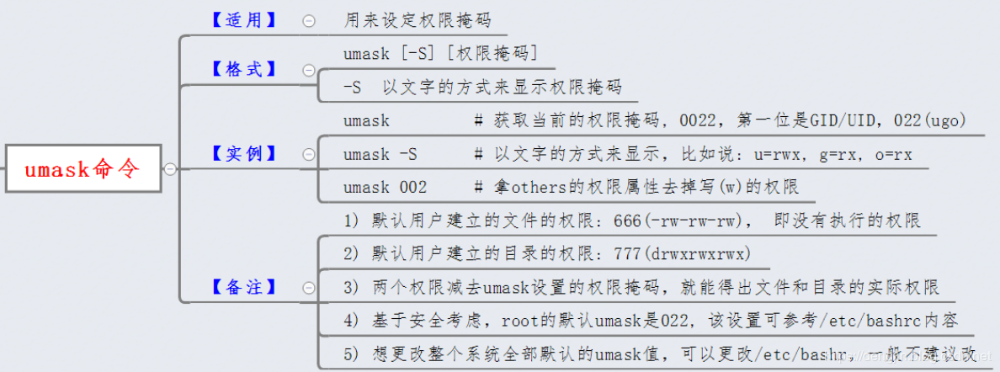
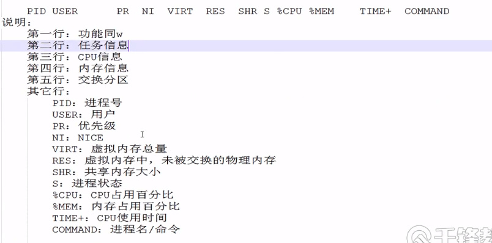
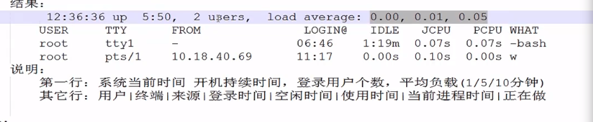
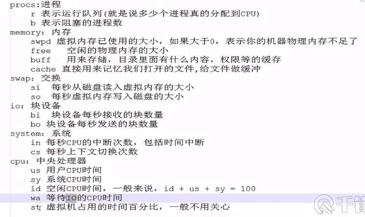

# Linux系统第二天

1）制作压缩包tar与zip
2) 管理用户与组：
    用户UID  useradd  id  /etc/passwd  passwd  /etc/shdaow  userdel 
     组GID  groupadd  gpasswd  /etc/group

3）权限和归属：基本权限 基本归属  chmod  chown
4）进程管理：pstree  ps aux  pgrep  进程前后台调度  杀死进程

## sort&uniq文本行排序命令

### sort

**参数：**
-b：忽略每行前面开始出现的空格字符
-c：检查文件是否已经按照顺序排序
-d：排序时，处理英文字母、数字及空格字符外，忽略其它字符。
-f：排序时，将小写字母视为大写字母
-i：排序时，除了040至176之间的ASCII字符外
-k:  通过键排序;KEYDEF给出位置和类型（和nr一起使用是放nr后面）
-m：将几个排序好的文件进行合并
-M：将前面三个字母依照月份的缩写进行排序
-n：依照数值大小进行排序
-o<输出文件>：将排序后的结果存入指定文件
-r：以相反的顺序来排序
-u: 忽略相同行 ，配合-c，严格校验排序；不配合-c，则只输出一次排序结果
-t<分割字符>：指定排序时所用的分隔符
+<起始栏位>-<结束栏位> 以指定的栏位来排序，范围由起始栏位到结束栏位的前一栏位
--help 显示帮助。

**实例：**

1. 以ASC||顺序排序

    ```shell
    sort test1
    ```

2. 忽略文件相同行

    ```shell
    sort -u test1#比下面的好使
    uniq test1
    #都可以
    ```

3. sort -n -r -k -t的使用
    原文件

    ```shell
    AAA:BB:CC
    aaa:30:1.6
    ccc:50:3.3
    ddd:20:4.2
    bbb:10:2.5
    eee:40:5.4
    eee:60:5.1
    ```

    - 将BB列按照数字从小到大顺序排列：

    ```
    sort -nk 2 -t: sort.txt
    AAA:BB:CC
    bbb:10:2.5
    ddd:20:4.2
    aaa:30:1.6
    eee:40:5.4
    ccc:50:3.3
    eee:60:5.1
    ```

    - 将CC列数字从大到小顺序排列：

    ```
    sort -nrk 3 -t: sort.txt
    eee:40:5.4
    eee:60:5.1
    ddd:20:4.2
    ccc:50:3.3
    bbb:10:2.5
    aaa:30:1.6
    AAA:BB:CC
    ```

    - **-n是按照数字大小排序(默认从小到大)，-r是以相反顺序，-k是指定需要爱排序的栏位，-t指定栏位分隔符为冒号**

4. **-k选项的语法格式：**

    - **从公司英文名称的第二个字母开始进行排序：**

    ```
    sort -t ' ' -k 1.2 book.txt  ##以空格为分隔符
    baidu 100 5000
    sohu 100 4500
    google 110 5000
    guge 50 3000
    ```

    - 使用k 1.2表示第一个域的第二个字符开始到本域的最后一个字符为止的字符串进行排序。sohu与google第二个字符相同，所以按照第三个字符来对这两字符谁前谁后排序。

### uniq

**作用：uniq命令用于报告或忽略文件中的相邻重复行，一般先使用sort命令把相同的放到一起后再使用**

- **选项：**
    -c或——count：在每列旁边显示该行重复出现的次数；
    -d或--repeated：仅显示重复出现的行列；
    -f<栏位>或--skip-fields=<栏位>：忽略比较指定的栏位；
    -s<字符位置>或--skip-chars=<字符位置>：忽略比较指定的字符；
    -u或——unique：仅显示出一次的行列；
    -w<字符位置>或--check-chars=<字符位置>：指定要比较的字符。

- 实例
    删除重复行：

    ```shell
    uniq file.txt
    sort file.txt | uniq
    sort -u file.txt
    ```

    只显示单一行

    ```shell
    uniq -u file.txt
    sort file.txt | uniq -u
    ```

    统计各行在文件中出现的次数：

    ```shell
    sort file.txt | uniq -c
    ```

    在文件中找出重复的行： 

    ```shell
    sort file.txt | uniq -d
    ```

    

## 管道操作   | ：

​        **将前面命令的输出，传递给后面命令，作为后面命令的参数**

**查看文件/etc/passwd内容的头4行？**

```shell
tarena@tedu:~$ head -4 /etc/passwd   
root:x:0:0:root:/root:/bin/bash
daemon:x:1:1:daemon:/usr/sbin:/usr/sbin/nologin
bin:x:2:2:bin:/bin:/usr/sbin/nologin
sys:x:3:3:sys:/dev:/usr/sbin/nologin
tarena@tedu:~$ 
```

   **查看文件/etc/passwd内容的8-12行内容？**

```shell
tarena@tedu:~$  head  -12   /etc/passwd
tarena@tedu:~$  head  -12  /etc/passwd  |  tail  -5
tarena@tedu:~$  head  -12  /etc/passwd  |  tail  -5  |  cat  -n

tarena@tedu:~$  cat   -n  /etc/passwd  |   head  -12    |   tail  -5

tarena@tedu:~$  echo 1+1
tarena@tedu:~$  echo 1+1    |    bc
tarena@tedu:~$  echo 3*8    |    bc

tarena@tedu:~$  ifconfig
tarena@tedu:~$  ifconfig    |    head   -2
tarena@tedu:~$  ls  --help    |    grep   A
```


**快捷键：**
      – Ctrl + l:清空整个屏幕 
      – Ctrl + c:废弃当前编辑的命令行(结束正在运行的命令)
      – Esc + . 或 Alt + . :粘贴上一个命令的参数

```shell
tarena@tedu:~$ ls   /etc/lsb-release 
/etc/lsb-release
tarena@tedu:~$ ls -l   Alt  +  .

tarena@tedu:~$ cat    Alt  +  .
tarena@tedu:~$ cat  -n   Alt  +  .
```

## 十一、vi或vim文本编辑器使用

**vi：基本的文本编辑器**
**vim：vi的升级版本**

 模式：命令模式      插入模式（输入模式）    末行模式

```shell
tarena@tedu:~$ sudo  vim   /home/tarena/haha.txt
```

**命----  i 键 或 o键 ----》 插入模式（Esc键回到命令模式）**
**令**
**模**
**式----  ：键 ----》 末行模式（Esc键回到命令模式）**

  **末行模式 **

- **:wq   保存并退出**

- **:q!  强制不保存退出**

```
tarena@tedu:~$ sudo  vim   /home/tarena/dc.txt
```

**命令模式** 

```shell
$ cp   /etc/passwd    /home/tarena/p.txt
$ vim    /home/tarena/p.txt
```

**光标的跳转**：
      行首： ^或home
      行尾： $或end
      全文的首行：gg  或 1G
      全文的最后一行：G
      全文的12行：12G
   **复制粘贴删除**
       yy：复制光标所在的当前行    2yy复制两行内容
        p：粘贴
      dd：删除光标所在的当前行    3dd删除三行内容
       u  ：撤销
       /bin  : 全文查找bin    按n向下跳转匹配   按N向上跳转匹配

**末行模式：**
 	   ：set   nu     #开启行号功能
        ：set   ai      #开启自动缩进功能
		： %s/原字符/目的字符/g     #全局替换

```shell
tarena@tedu:~$ vim /home/tarena/b.txt
```

## 一、制作压缩包tar与zip

-    – -c:创建归档
-    – -z、-j、-J:调用 .gz、.bz2、.xz格式的工具进行处理
-    – -f:指定归档文件名称，必须在所有选项的最后
-    – -x:释放归档 
-    – -t:显示归档中的文件清单
-    – -C:指定释放路径

#### **Linux平台的压缩格式：**

​     gzip---->.gz
​     bzip2---->.bz2
​     xz----->.xz

1. 归档：将众多的数据，归档整理成一个文件

2. 压缩：采用压缩算法，计算数据占用空间大小

#### **制作tar包**

**格式：  tar  选项      /路径/压缩包的名字       被压缩的源数据**

```shell
$ sudo tar   -zcf    /opt/aid.tar.gz     /boot/     /etc/lsb-release 
[sudo] tarena 的密码： 
tar: 从成员名中删除开头的“/”
$ ls    /opt/

$ sudo tar   -jcf    /opt/abc.tar.bz2   /boot/   /etc/lsb-release 
$ ls    /opt/

$ sudo tar  -Jcf   /opt/file.tar.xz    /boot/    /etc/lsb-release
$ ls    /opt/
```

- -z：利用gzip进行压缩   ==>gz
- -j：利用bzip2进行压缩   ==>bz2
- -J：利用xz压缩 ==>xz

#### **查看压缩包内容**

```shell
tarena@tedu:~$ tar    -tf     /opt/abc.tar.bz2  
```

#### **解包：**

**格式：tar  选项   /路径/tar包的名字    -C   释放的位置**

```shell
tarena@tedu:~$ sudo mkdir /aid01
tarena@tedu:~$ sudo  tar   -xf   /opt/abc.tar.bz2    -C     /aid01
tarena@tedu:~$ ls   /aid01/
tarena@tedu:~$ ls   /aid01/etc/

tarena@tedu:~$ sudo mkdir /aid02
tarena@tedu:~$ sudo  tar   -xf   /opt/file.tar.xz    -C     /aid02
tarena@tedu:~$ ls   /aid02
tarena@tedu:~$ ls   /aid02/etc/
```

#### zip跨平台的压缩格式（windows与Linux）

**制作压缩包：**
**格式：zip   -r     /路径/压缩包名字      被压缩的源数据**

```shell
$ sudo   zip    -r     /opt/stu.zip    /boot/    /etc/lsb-release 
$ ls   /opt/
```

**释放压缩包：**

```shell
$ sudo   mkdir  /aid03
$ sudo   unzip   /opt/stu.zip   -d    /aid03/
$ ls   /aid03
$ ls   /aid03/etc
$ ls   /aid03/boot
```


## 二、管理用户与组：

**系统用户：**1.登录操作系统    2.权限不同
       组：方便管理用户
       唯一标识： UID    GID
       

**组分类：**基本组   附加组
   一个用户必须至少属于 一个组

```shell
tarena@tedu:~$ useradd aid01
```

创建同名组：aid01组      将aid01用户加入到aid01组
自行创建组：财务组  销售组  帅哥组   美女组     将aid01用户加入

#### 总结：

aid01用户一共属于5各组：aid01组  财务组  销售组  帅哥组   美女组 
            aid01组为aid01用户的基本组
            财务组  销售组  帅哥组   美女组为aid01用户的 附加组

#### 一、创建用户：adduser   useradd

```shell
tarena@tedu:~$ sudo adduser aid02           #交互式创建
tarena@tedu:~$ sudo useradd  -m  aid03    #非交互式创建
             -m：创建用户的家目录
             -u：设置用户id

tarena@tedu:~$ id  aid02     #查询存在用户的信息
tarena@tedu:~$ id  aid03     #查询存在用户的信息
```

用户家目录：存放用户个性化信息的目录
管理员root的家目录：/root
存放 所有普通用户的家目录：/home

  **~:表示家目录**

```shell
tarena@tedu:~$ sudo useradd -m aid04
tarena@tedu:~$ ls /home/
```

**/etc/passwd:存放所有用户信息的配置文件**

```shell
tarena@tedu:~$ tail -1 /etc/passwd
aid04:x:1003:1003::/home/aid04:/bin/sh
```

用户名:密码占位符:UID:基本组GID:用户描述:家目录:解释器程序

**/etc/shadow：存放密码信息的配置文件**

```shell
tarena@tedu:~$ sudo grep   aid   /etc/shadow
```


#### 二、设置用户密码

```shell
tarena@tedu:~$ sudo passwd aid0
输入新的 UNIX 密码： 
重新输入新的 UNIX 密码： 
passwd：已成功更新密码
tarena@tedu:~$ sudo grep aid /etc/shadow

```

**非交互式设置密码  echo    用户名：密码     |    sudo  chpasswd** 

```shell
$ sudo   useradd   -m  tom    #创建用户并且创建家目录
$ id  tom

$ sudo  grep  tom   /etc/shadow
#修改密码
$ echo  tom:123    |    sudo    chpasswd 
$ sudo  grep    tom    /etc/shadow
```

#### 三、删除用户

   **userdel**
    **-r：递归删除，删除用户的家目录以及用户的邮件文件**

```shell
tarena@tedu:~$ sudo    userdel    aid02
tarena@tedu:~$ id    aid02
id: "aid02": no such user
tarena@tedu:~$ ls   /home/

tarena@tedu:~$ sudo   userdel    -r    aid03
userdel: aid03 邮件池 (/var/mail/aid03) 未找到
tarena@tedu:~$ ls    /home/
```

#### 四、 组管理  

```shell
tarena@tedu:~$ sudo  groupadd   tedu           #创建组账号
```

**组信息存放的配置文件:/etc/group**

```shell
tarena@tedu:~$ grep   tedu   /etc/group
  tedu:x:1005:
```

**组名:密码占位符:GID:组的成员列表**

```shell
tarena@tedu:~$ sudo  gpasswd   -a   tom    tedu    #添加组成员
tarena@tedu:~$ grep   tedu   /etc/group
tarena@tedu:~$ id   tom

tarena@tedu:~$ sudo   gpasswd   -a   aid04   tedu   #添加组成员
tarena@tedu:~$ grep  tedu   /etc/group

tarena@tedu:~$ sudo   gpasswd  -d   aid04    tedu  #删除组成员
tarena@tedu:~$ grep   tedu   /etc/group
```

**组的删除：groupdel  组名**

```shell
tarena@tedu:~$ sudo   groupdel   tedu
tarena@tedu:~$ grep  tedu    /etc/group
```

## 三、权限和归属：

**基本权限** 
            r：读入权限
           w：写入权限
            x：执行权限
**文本文件**：
            r：cat  head  tail  
            w：vim    >     >> 
            x: Shell脚本  Python脚本 cd
**归属关系：**
        所有者（属主）：数据创建者			u
        所属组（属组）：所有者的基本组
        其他人：除了所有者与所属组成员其余的用户    o

​	d  rwx  r-x  r-x    d表示目录文件,前3个rwx 表示所有者权限，中间3个为所属组，后面三个为其他人

​	   zhangsan    zhangsan组    1.txt

**查看权限：  ls  -l  或  ls  -ld**

- 以-开头为文本文件
- 以d开头为目录

```shell
tarena@tedu:~$ ls   -ld   /etc
tarena@tedu:~$ ls   -ld   /home/tarena
tarena@tedu:~$ ls   -ld   /root
tarena@tedu:~$ ls   -l    /etc/passwd
tarena@tedu:~$ ls   -l    /etc/shaow
```

**Linux判断用户具备的权限：匹配即停止(短路原则)**
  1.判断用户对于该数据所处的身份      所有者>所属组>其他人
  2.查看相应身份权限位置表示

**命令行临时切换用户身份： su  -   用户**

```shell
$ sudo  useradd   -m   harry
$ echo  harry:123   |    sudo  chpasswd 
$ sudo  usermod  -s  /bin/bash   harry     #修改用户解释器程序
$ grep  harry  /etc/passwd
```

  **Ctrl + shift  +t  : 新开一个终端**

```shell
tarena@tedu:~$ sudo   mkdir  /aid10 
tarena@tedu:~$ sudo   touch  /aid10/1.txt
tarena@tedu:~$ sudo   vim    /aid10/1.txt 
AAAAAAAAAA

$ sudo  chmod   o+w   /aid10/1.txt      #o表示其他人加上w权限,u表示拥有者,直接+w,所有人加读权限
$ ls   -l   /aid10/1.txt
```

**目录权限管理：** 
    r：显示目录内容
    w：可以在此目录下新建  删除  复制 移动.... 子文件或子目录
    x：用户切换到该目录

**归属关系的修改： chown   所有者：所属组      参数**

```shell
tarena@tedu:~$ sudo  mkdir   /aid11
tarena@tedu:~$ ls -ld  /aid11
tarena@tedu:~$ sudo   groupadd   study
tarena@tedu:~$ sudo  chown   harry:study    /aid11#仅修改所有者和所属组
tarena@tedu:~$ ls   -ld   /aid11

tarena@tedu:~$ sudo  chown   root    /aid11         #仅修改所有者
tarena@tedu:~$ ls   -ld   /aid11

tarena@tedu:~$ sudo  chown   :tarena    /aid11     #仅修改所属组
tarena@tedu:~$ ls   -ld   /aid11


sudo chown -R ubuntu:ubuntu Travel/ #递归修改目录下的所有文件的权限
```

- **umask：修改权限**
    

## 四、进程管理：

  **程序：**静态的代码  占用硬盘空间

  **进程：**动态执行的代码    占用CPU 与 内存

  父进程与子进程   树型结构     僵尸进程/孤儿进程
   		进程标识：PID

#### 1.查看进程：

**systemd：**所有进程父进程，上帝进程

**pstree ：**结构非常优秀
		-p：进程的PID            

```shell
tarena@tedu:~$ pstree  -p   |   grep   mysql
```

 **ps  aux ：**正在运行的所有进程详细信息

```shell
tarena@tedu:~$ ps  aux
```

**pgrep :检索进程信息**,PID

```shell
tarena@tedu:~$ pgrep   oneko
15490
tarena@tedu:~$ pgrep   -l  oneko      #-l：显示完整进程名
15490 oneko
```

**top：**动态的排名    按P（大写）进行CPU排序(默认)
                                  按M（大写）进行内存排序

```shell
top - 11:39:31 up 4 days,  2:54,  1 user,  load average: 0.98, 1.15, 1.17
任务: 329 total,   1 running, 282 sleeping,   0 stopped,   0 zombie
%Cpu(s):  6.8 us,  2.0 sy,  0.0 ni, 90.6 id,  0.2 wa,  0.0 hi,  0.4 si,  0.0 st
KiB Mem :  8058080 total,  1148968 free,  3678040 used,  3231072 buff/cache
KiB Swap:  2097148 total,  1724412 free,   372736 used.  2810344 avail Mem 
```



**w:**当前系统在干嘛


**vmstat:**

```shell
tarena@tarena:~/桌面$ vmstat
procs -----------memory---------- ---swap-- -----io---- -system-- ------cpu-----
 r  b   交换     空闲  缓冲      缓存   si   so    bi    bo   in   cs  us sy id wa st
 6  0 372736 1381456 478932 2664248    0    0    10    17   28   18  5  2  92  0  0
```



####  2.进程前后台调度

​	**• 后台启动** 
​	– 在命令行末尾添加“&”符号,不占用当前终端,后台启动
​	**• Ctrl + z 组合键**
​	– 挂起当前进程(暂停并转入后台)	
​	**• jobs 命令**
​	– 查看后台任务列表
​	**• fg 命令**
​	– 将后台任务恢复到前台运行
​	**• bg 命令**
​	– 激活后台被挂起的任务

####   3.杀死进程

​      **kill：** 结合PID进行杀死，支持 -9选项  强制杀
​      **killall:**结合进程名进行杀死，支持 -9选项  强制杀
​      **pkill：**模糊进行匹配进程名

​	**杀死一个用户开启的所有进程：有登录的状态变成未登录**

```shell
killall  -9  -u   用户名
```

####   4.查看当前系统监听的端口：

​	 **netstat  -anptu  或者ss 命令**

​     -a：所有正在监听         -n：数字方式显示
​     -p：显示协议信息          -t：tcp协议
​     -u：udp协议

## 五、关闭防火墙（负载均衡时使用）

1. #### 查看当前防火墙状态

  在Ubuntu中 我们使用**sudo ufw status**命令查看当前防火墙状态;

- inactive状态是防火墙关闭状态 
- active是开启状态。

```shell
tarena@tarena:/usr/share$ sudo ufw status 
[sudo] tarena 的密码： 
状态：不活动
```

2. #### 开启防火墙

**sudo ufw enable命令来开发防火墙**

```shell
tarena@tarena:/usr/share$ sudo ufw enable
在系统启动时启用和激活防火墙
tarena@tarena:/usr/share$ sudo ufw status 
状态： 激活
```

3. #### 关闭防火墙

**sudo ufw disable命令来关闭防火墙**

```shell
tarena@tarena:/usr/share$ sudo ufw disable
防火墙在系统启动时自动禁用
```

4. #### Ubuntu中其他常用的防火墙命令

- ufw default allow/deny:外来访问默认允许/拒绝
- ufw allow/deny 20：允许/拒绝 访问20端口,20后可跟/tcp或/udp，表示tcp或udp封包。
- ufw allow/deny servicename:ufw从/etc/services中找到对应service的端口，进行过滤。
- ufw allow proto tcp from 10.0.1.0/10 to 本机ip port 25:允许自10.0.1.0/10的tcp封包访问本机的25端口。
- ufw delete allow/deny 20:删除以前定义的"允许/拒绝访问20端口"的规则

## 关机重启

- **centos**
    - reboot   普通重启
        1. shutdown -r now 立刻重启(root用户使用)
        2. shutdown -r 10 过10分钟自动重启(root用户使用)
        3. shutdown -r 20:35 在时间为20:35时候重启(root用户使用)
        4. 如果是通过shutdown命令设置重启的话，可以用shutdown -c命令取消重启
    - Linux centos关机命令：
        1. halt 立刻关机
        2. poweroff 立刻关机
        3. shutdown -h now 立刻关机(root用户使用)
        4. shutdown -h 10 10分钟后自动关机