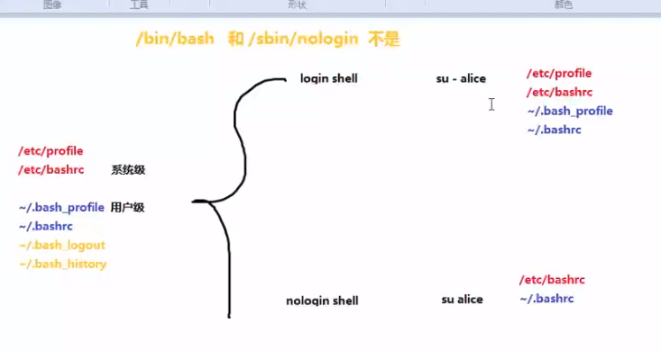

## shell编程

- **shell和Python的区别**
    - Python是调用模块\通用设计语言
        Shell是调用命令\Linux系统自动化

### 二、shell 命令解释器

shell命令 cp  ls   date
Linux支持的shell
	cat /etc/shells
	chsh -l

### 三、GUN和bash shell特点

1. 命令和文件自动补齐功能
2. 命令历史技艺功能 上下键、!number、
    1. !string 、最近出现的命令模糊匹配
    2. !$、上一个命令的最后一个参数
    3. !!、  上一个命令
    4. ^R     ctrl+r 搜索历史命令
3. 别名功能 alias  unalias cp   ~username/.bashrc 
    
    1.  \cp -rf /etc/hosts  加斜线跳过表名
4. 快捷键 ^R  ^D  ^A  ^E  ^U  ^K  ^S  ^Q  
5. 前后台作业控制 &  
    1.  nohup    把进程放到后端
    2. ^C  ^Z   bg  %1    kill%3 
    3.  fg%1   vim妙用  ，首先是进入vim，编辑一半，ctrl+z 退出，命令行操作，fg返回vim
    4. screen 
6. 输入输出重定向 0输入,1输出,2输出错误，>  >>   2>   2>> 2>&1   &> 混合输出，无论对错     cat <  /etc/hosts   、 cat<<EOF 、
    
1. cat > file1 <<EOF   快速输入内容到文件中去
    
7. 管道 |

    - |tee 类似重定向，好处是内容可以打印在屏幕同时输入到文件中去

        - |tee   filename    将管道的某段内容写到文件中取
        - |tee  -a   filename   追加

        ```shell
        [tarena@localhost ~]$ date |tee date.txt
        2019年 08月 23日 星期五 04:40:47 PDT
        [tarena@localhost ~]$ cat date.txt 
        2019年 08月 23日 星期五 04:40:47 PDT
        ```

8. 排序命令
    ;          不具备逻辑判断,分号分行
    cd:eject
    &&     ||  具备逻辑判断

    ```shell
    ./configure  && make && make install (命令返回值  echo $?)
    mkdir /var/111/2222/333  && echo ok
    mkdir -p /var/111/222/333  && echo ok
    ls /home/111/222/333/444 || mkdir -p /home/111/222/333/444
    [  -d /home/111/222/333/444 ] || mkdir -p /home/111/222/333/444
    ping -c1 176.234.8.16 &> /dev/null && echo up || echo dwon 
    ```

    - **注意：**
        command &					          后台运行
        command & >/dev/null           混合重定向(标准输出1，错误输出2)
        command 1&& command2    命令排序，逻辑判断

### 1.Shell

   扩展名一般是.sh
   正文的第一行必须是解释器#!/bin/bash
   #注释
   调用命令的代码

**login_shell和nologin_shell**：



- **图片解析：**环境文件红色的和蓝色的是登录时执行，黄色的是用户退出时执行，login shell  登录时启动全部环境，nologin shell 只执行bashrc文件 ，su的时候 -的区别

    ```
    [tarena@localhost ~]$ cat /etc/shells 
    /bin/sh
    /bin/bash
    /sbin/nologin
    /usr/bin/sh
    /usr/bin/bash
    /usr/sbin/nologin
    /bin/tcsh
    /bin/csh
    ```

    - 每行最后面显示nologin为非登录shell

### 2.执行shell脚本的格式

  1)加权限,相对路径或绝对路径执行
  2)没有权限,bash 脚本名称
  3)source 脚本名   [不启动shell子进程]
  4)   .  脚本名[不启动shell子进程]

  正常执行脚本

```shell
bash----->test.sh(命令exit)
```

  不启动子进程和启动子进程的区别

```shell
tarena@tarena:~/桌面/code$ vim shell02.sh
#!/bin/bash
cd /home/
ls
tarena@tarena:~/桌面/code$ ./shell02.sh		#启动子进程执行脚本
aid02  aid04  tarena
tarena@tarena:~/桌面/code$ . ./shell02.sh	    #不启动子进程执行脚本，
aid02  aid04  tarena
tarena@tarena:/home$    	#本窗口路径跳转到脚本命令执行后的地方
#启动子进程就是得到结果，结果不影响本shell窗口。不启动就是本窗口执行命令,路径跳转
```

### 3.变量

  自定义变量、预设变量

- **自定义变量格式：**
        变量名=值   （不能有空格）
        Shell的变量属于弱类型
        变量名：字母、数字、下划线，不能数字开始
- **调用变量的格式：**
        echo $变量名 

``` shell
price=12
echo $priceRMB
echo ${price}RMB
```

  **预设变量:**

```shell
echo $USER $UID $PWD $PATH
```

PATH变量存储的是命令搜索路径 
    **$$当前进程的进程号**   

   **$!前一个后台进程的进程号**

``` shell
sleep 100 &
echo $!
```

​    **$1,$2,$3...脚本的位置变量**

 ```shell
vim test.sh
    #!/bin/bash
    echo $1
    echo $2
    echo $#
    echo $
chmod +x test.sh
./test.sh a 11 c op
 ```

- $1脚本的第一个参数
- $2脚本的第二个参数...
- $#所有参数的个数
- $*所有的参数的值
- $?返回上一条命令执行的状态(0代表正确,非0代表失败)

```shell
vim test.sh
	#!/bin/bash
	touch $1/$2
chmod +x test.sh
./test.sh  /tmp   myfile
```

### read命令读取用户的输入:

read 变量名(类似于python3 inupt)

​    >等待用户输入

read -p 提示信息:  变量名

read -t 2 -p 提示  变量名

​       限制2秒钟必须输入值

```shell
vim test.sh
	#!/bin/bash
	read -p 请输入用户名:  username
	read -p 请输入密码:    passwd
	useradd $username
	echo "$username:$passwd" | chpasswd
```


### 判断[数字、字符、文件或目录...]

   判断的语法格式:
   [  判断语句  ]      //注意括号必须有空格

   && 并且
   || 或者

   A命令  &&  B命令   //仅当A成功时才执行B
   A命令  ||  B命令   //仅当A失败时才执行B

```shell
[ a == a ] && echo Y || echo N
```

   || ==两边必须有空格

```shell
[ a == b ] && echo Y || echo N
```


**1)字符判断**

​     [ A == A ]    #相等(等号两边需要有空格)
​     [ A != B ]    #不相等
​     [ -z $变量 ]  #判断是否为空zero 

```shell
[ a == a ] && echo Y || echo N
[ a != a ] && echo Y || echo N
[ -z $angle ] && echo Y || echo N
[ $USER == root ] && echo Y || echo N
vim test.sh#!/bin/bash
	read -p "请输入用户名:" username
	[ -z $username ] && exit
	read -p "请输入密码:"   passwd
	[ -z $passwd ] && exit
	useradd $username 
	echo "$username:$passwd" | chpasswd
```

**2)数字比较(man test)**

​	-eq	等于(equal)
​	-ne	不等于(not equal)
​	-gt	大于(greater than)
​	-ge	大于等于(great or equal)
​	-lt	小于(less than)
​	-le	小于等于(less or equal)

```shell
[ 3 -eq 3 ] && echo Y || echo N
[ 4 -le 3 ] && echo Y || echo N
[ 5 -ge 3 ] && echo Y || echo N
```

**3)文件或目录**

​       [ -e 文件或目录 ]    #是否存在exist

​       [ -f  文件      ]    #存在且为文件file

​       [ -d  目录      ]    #存在且为目录directory
​       [ -r 文件或目录 ]    #判断是否可读read
​       [ -w 文件或目录 ]    #判断是否可写write
​       [ -x 文件或目录 ]    #判断是否可执行

```shell
[ -e /etc/passwd ] && echo Y || echo N 
[ -f /etc/passwd ] && echo Y || echo N
[ -d /etc/passwd ] && echo Y || echo N
```

### if语句:

**1)单分支**

​     if 判断 ;then
​        命令
​        命令
​     fi

**2)双分支**

​     if 判断 ;then
​	命令1
​     else
​        命令2
​     fi

**3)多分支**

​     if 判断;then
​        命令1
​     elif 判断 ;then
​        命令2
​     else
​        命令3
​     fi

```shell
vim test.sh
	#!/bin/bash
	if [ $USER == tarena ];then
		echo "Yes,You are Tarena."
	else
		echo "Oops,You are other man."
	fi
```

```shell
vim test.sh
	#!/bin/bash
	num=$RANDOM
	read -p "我有一个随机数,你猜:"  guess
	if [ $guess -eq $num ];then
		echo "恭喜,猜对了."
		exit
	elif [ $guess -gt $num ];then
		echo "你猜大了"
	else
		echo "你猜小了"
	fi
```

### 数字运算:

  1) echo $[数字+数字]      #+ - * / %

  2) let 变量=数字+数字     #++ --  += -= *= /= 
```shell
echo $[2+3]
echo $[2*3]
echo $[10-3]
let x=2*8
echo $x
```

### **循环操作:for,while**

**for的语法格式:**

  for 变量 in 值序列
  do
     命令
  done

```shell
for i in 1 2 3 4 5
do
   echo "凤姐"
done
```

```shell
vim test.sh
	#!/bin/bash
	num=$[RANDOM%100]
	for i in {1..100}
	do
		read -p "我有一个随机数,你猜:"  guess
		if [ $guess -eq $num ];then
			echo "恭喜,猜对了."
			exit
		elif [ $guess -gt $num ];then
			echo "你猜大了"
		else
			echo "你猜小了"
		fi
	done
```

**while循环:**

   while 判断            #判断为真则执行命令
   do
      命令
   done

```shell
vim test.sh
	#!/bin/bash
	i=1
	while [ $i -lt 5 ]
	do
   		echo baby
   		let i++
   	done
```

```shell
vim test.sh
	#!/bin/bash
	while :#死循环
	do
		echo baby
   		sleep 0.1
	done
```

### 函数:

   **1)定义函数**
     函数名(){
	命令
     }
   **2)调用函数就是直接写 函数名称      //不能写()**

```shell
echo -e "\033[34mOK\033[0m"   调用echo函数
```

```shell
vim test.sh
	#!/bin/bash
	cecho(){
   		echo -e "\033[32mOK\033[0m"
	}
	cecho   #函数调用
	cecho	#函数调用
```

```shell
#$1 $2 $3  位置传参
vim test.sh
	#!/bin/bash
	cecho(){
   		echo -e "\033[$1m$2\033[0m"
	}
	cecho 32 OK
	cecho 33 Error
	cecho 34 Warning
```

```shell
vim test.sh
	#!/bin/bash
	for i in {1..254}
	do
   		ping -c2 -i0.2 -W1 172.40.91.$i &>/dev/null
   		if [ $? -eq 0 ];then
	 		echo "172.40.91.$i is up."
   		else
	 		echo "172.40.91.$i is down."
   		fi
	done
```

- **函数单行写法 ：**

```shell
ceho(){ echo dd;};ceho;
```

​	**注意: 双引号里面$1,$2可以传参，单引号不行，显示$1 打印$1 ,字符串传参用双引号**

### cookie:

**ping 的用法,检测是否和某ip地址能相连**

​	-c 2 127.0.0.1 只ping 两次
​	-i 2  间隔2s ，最好不要小于0.2
​	-w 1 timeout 1s内ping不到 就结束

**/dev/null   可以把没有用的结果重定向到这个文件中**

**$(命令)    提取命令的结果值**

**free 看内存**

**df -h 看硬盘**

**uptime 查看电脑运行情况,开机时间等,cpu负载**

**tail -f 实时加载看文件**

**/var/log/auth.log 看系统日志**

**sort 排序 -u**

**ab -c  100 -n 10000 http://172.0.0.1/a.mp4   访问这个url 10000次**

--------------------------------------------

```shell
vim test.sh
	#!/bin/bash
	#多进程版本的ping
    myping(){
   		ping -c2 -i0.2 -W1 $1 &>/dev/null
   		if [ $? -eq 0 ];then
	 		echo "$1 is up."
   		else
	 		echo "$1 is down."
   		fi
		}
		for i in {1..254}
		do
   			myping 172.40.91.$i &
		done
	wait
```

- **//等待所有后台子进程结束，主脚本才结束.**

### 正则表达式:(模糊匹配)

使用一些特征来描述你的数据.

- **网站日志:IP(哪个地区的用户)**

​         PV(page view),UV(user view)
​	 	热点数据...
​			(用户画像--->千人千面)

- **基本正则:(单个字符为单位)**

   ^(开始) $(结尾) []集合 [^]集合取反
   .(任意单个字符)
   *(匹配任意次)
   \{n,m\}  \{n\}   \{n,\}

- **扩展正则:**

​    {n,m}  {n,}  {n}
​    +(匹配至少1次)  
​    ?(匹配0或1次)
​    ()组合+保留

- **Posix正则:**

​    [:alpha:] [:digit:] [:alnum:] [:punct:]
​    [:space:]... 

- **perl正则**

​    \d,\w,\s,\W

++++++++++++++++++++++++++++++++++
### sed(非交互文本编辑器,逐行处理软件)

**语法格式:**
   **sed [选项]  '条件指令'  文件名**
指令:增、删、改、查
条件:仅对特定的行执行指令

```shell
sed -n '3p'    /etc/passwd	#只打印第三行
```

```shell
sed -n '1,3p'  /etc/passwd	#只打印第一行到第三行
```

```shell
sed -n '1~2p'  /etc/passwd	#只打印从第一行开始步长为2，奇数行
```

```shell
sed -n '2~2p'  /etc/passwd	#只打印从第二行开始步长为2，偶数行
```

```shell
sed -n '3p;5p' /etc/passwd	#只打印第三行和第五行
```

```shell
sed -n '$p'    /etc/passwd	#只打印第最后一行
```

```shell
vim test.sh
	#!/bin/bash
	file=a.txt
	num=$(sed -n '$=' $file)
```

**#$(命令)提取命令的返回值**

```shell
while :
do
   clear
   line=$[RANDOM%num+1]
   sed -n "${line}p" $file
   sleep 0.5
done
```

- **语法格式:**

   **sed [选项] '条件+指令'  文件名**
指令:增、删、改、查
条件:仅对特定的行执行指令

**1)选项:**
	-n(默认sed会自动输出所有行,-n屏蔽默认输出)
	-r(默认sed不支持扩展正则,-r支持扩展正则)
	-i(默认在内存中修改文件,将结果显示在屏幕)
        使用-i选项则可以修改源文件(永久保存)

**2)条件:**
     使用行号做条件:3p; 3,5p; 1~2p
     使用正则做条件:/正则/

```shell
sed -n '/root/p'  /etc/passwd

//找包含root的行,并打印改行内容
```

```shell
sed -n '/bash$/p'  /etc/passwd

//找包含bash结尾的行并打印
```

```shell
sed -rn '/ro{2}/p'  /etc/passwd

//支持扩展正则,匹配roo并打印改行(默认不支持扩展正则)
```

**3)指令:**

- p(print)打印行
- d(delete)删除行
- c(change)替换行
- s(substitution)替换关键词 s/旧/新/
- a(append)追加行(下面)
- i(insert)插入行(上面)	

```shell
sed  '3d'           文件名   

//删除第三行   
```

```shell
sed  '3c xxx'       文件名

//将第三行替换为xxx
```

```shell
sed  '/root/c xxx'  文件名

//找到包含root的行，并替换为xxx
```

```shell
sed 's/localhost/123/'  /etc/hosts

//把文件中第一个localhost替换为123
```

```shell
sed 's/2009/XXXX/g'   a.txt

//把每一行的所有2009都替换为XXXX 
```

```shell
sed  's/2009//g'      a.txt

//删除文件中所有的2009
```

```shell
sed  '2a XYZ'  /etc/hosts

//在第二行后面添加一行XYZ
```

```shell
sed  '2i XYZ'  /etc/hosts

//在第二行的前面添加一行XYZ
```

```shell
sed  '/root/a XYZ'  文件名
//
sed  '/root/i XYZ'  文件名
```

### awk(数据过滤,逐行处理)

作用：正则匹配行（列），查看特定列，指令满足条件就执行一次，可以是打印也可以是计算，在END后最后操作一个

**语法格式: **

 -   **awk  [选项]  '条件{指令}'  文件名**
-   **命令 | awk  [选项]  '条件{指令}'**
-   **awk [选项]  '条件{指令}  END{指令}'  文件名**

**awk内置变量: $1, $2,$3(第一列,第二列,第三列...)**

```shell
df -h | awk  '{print $4}'

//把硬盘的剩余空间打印出来(逐行处理)
```

```shell
df -h | awk  '{print $1,$4}'

//把所有磁盘的名称和剩余空间显示出来
```

```shell
free | awk  '{print $7}' 

//显示剩余内存容量
```

```shell
free  | awk '/内存/{print $7}'

//匹配包含有<内存>的行，然后打印该行的第7列
```

```shell
awk '/Failed password/{print $11}' auth.log
```

**awk有一个-F选项可以自定义分隔符,分列**
**(默认使用空格或tab为分隔符)**

```shell
awk -F:  '{print $1}'  /etc/passwd
```

#### awk的条件:

​    /正则/      对整行数据进行正则匹配
​    $1~/正则/   仅对第1列进行正则匹配
​    ==,!=,>,>=,<,<=  进行精确匹配    

```shell
awk -F: '$1~/root/'   /etc/passwd

//在每行的第1列进行正则匹配,打印包含root的行
```

```shell
awk -F:  '$1~/m/'    /etc/passwd

//把所有用户名中包含m的账户信息打印出来
```

```shell
awk -F:  '$1=="root"'  /etc/passwd

//精确判断每行的第1列是root，则打印该行
```

```shell
awk -F:  '$3>=1000'  /etc/passwd

//把所有UID大于等于1000的用户信息打印出来
```

#### awk的语法格式:

- **awk [选项]  '条件{指令}  END{指令}'  文件名**

- **END{}中的指令,仅在所有文件内容读取完成后执行1次.**

**利用awk也可以做统计工作:**

```shell
awk  -F:  '$3>=1000{x++}'              /etc/passwd
awk  -F:  '$3>=1000{x++} END{print x}' /etc/passwd

//统计uid大于1000的用户个数
//在Linux中大于等于1000的用户为普通用户
//小于1000的用户是系统用户
```

```shell
awk '$7~/mp3$/{x++} END{print x}' access_log

//统计日志文件中mp3的访问次数
```

```shell
awk '$7~/mp3$/{x++} END{print "mp3的访问量:",x}' access_log

//统计mp3文件的访问次数.
```